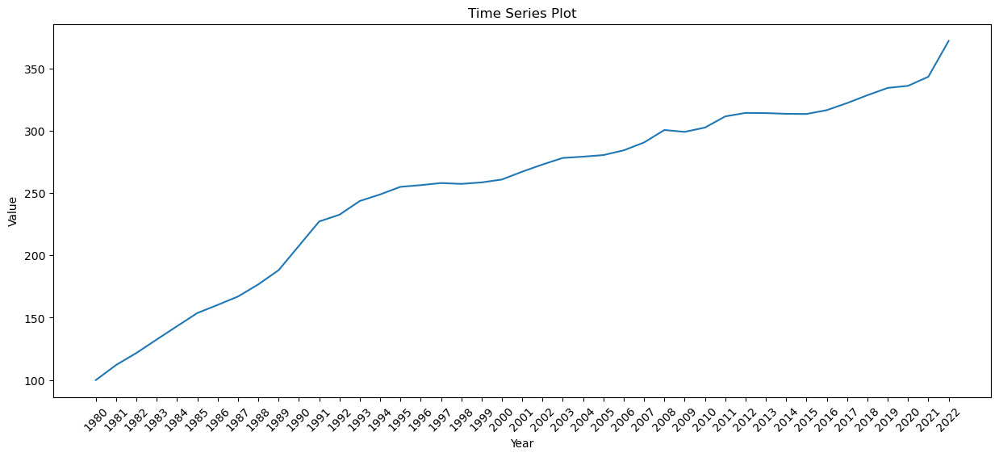

# HW1

## A brief description of your previous experience with Data Science
#### I was one of student that studied Da3018 VT23, the main thing I learned from that course is using github and terminal. In fact you could find the project I did in that course just by looking at my repository,that project is fun but a nightmare to deal with. 
#### Basically we were given abountch of data and you need wash them and find the "right" data, you are supposed to use Java for that project but I tried python and it ended up with low cpu utilization(the computer was running 10 hours and still no result) or spyder(python ide) uses all 64gb of my rams which leads to my pc freeze.
#### At the end I just returned to java instead.
##### Now I'm really curious how r studio will perform in this type of scenario.

## A plot, using for instance pyplot(Python) or ggplot. The data-set should be found on the web (i.e. not one that is preloaded in some package) and you should document any steps taken in retrieving the data. Google something you like and add “free dataset”, “data” or perhaps download something fun from scb.se!

#### I found something good here  (https://www.scb.se/hitta-statistik/sverige-i-siffror/samhallets-ekonomi/kpi/), now lets make a graph out of this csv file.
#### the data is structured over time, with year as the column name, we can digest the data into a long format dataset with one column for year and another for value, and then plot it.


```python
import matplotlib.pyplot as plt
import pandas as pd

# Load the dataset
data = pd.read_csv('~/Desktop/PR0101B5.csv')

# Melt the data to long format
data_long = data.melt(id_vars='Unnamed: 0', var_name='Year', value_name='Value')

# Plotting
plt.figure(figsize=(15,6))  # Increase the width of the figure
plt.plot(data_long['Year'], data_long['Value'])
plt.title('Time Series Plot')
plt.xlabel('Year')
plt.ylabel('Value')
plt.xticks(rotation=45)  # Rotate x-axis labels by 45 degrees (optional)
plt.show()


```


    

    


```python

```
