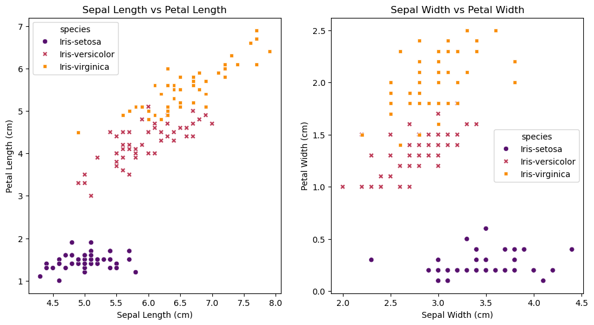
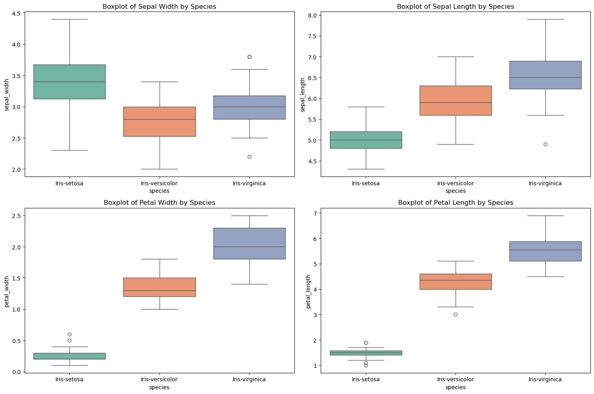
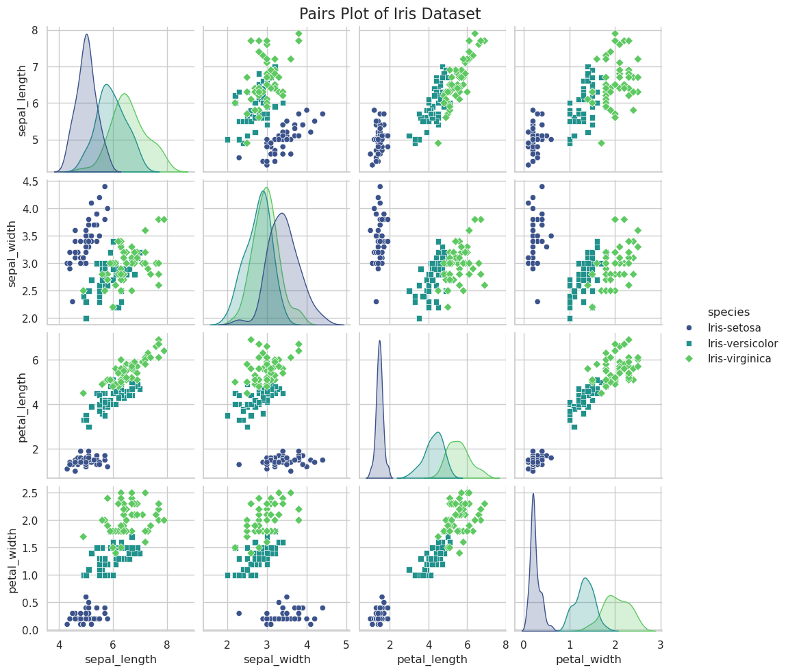

# Hw3

## 1. IRIS Data Analysis

### Let's begin with loading and taking a quick look at the data, this will help us create the graph.


```python
import pandas as pd
import matplotlib.pyplot as plt
import seaborn as sns


# Load the IRIS dataset
iris_data_path = '/home/xyc/Downloads/hw3/IRIS.csv'
iris_data = pd.read_csv(iris_data_path)

# Display the first few rows of the dataset to understand its structure
iris_data.head()

```


<div>
<style scoped>
    .dataframe tbody tr th:only-of-type {
        vertical-align: middle;
    }

    .dataframe tbody tr th {
        vertical-align: top;
    }

    .dataframe thead th {
        text-align: right;
    }
</style>
<table border="1" class="dataframe">
  <thead>
    <tr style="text-align: right;">
      <th></th>
      <th>sepal_length</th>
      <th>sepal_width</th>
      <th>petal_length</th>
      <th>petal_width</th>
      <th>species</th>
    </tr>
  </thead>
  <tbody>
    <tr>
      <th>0</th>
      <td>5.1</td>
      <td>3.5</td>
      <td>1.4</td>
      <td>0.2</td>
      <td>Iris-setosa</td>
    </tr>
    <tr>
      <th>1</th>
      <td>4.9</td>
      <td>3.0</td>
      <td>1.4</td>
      <td>0.2</td>
      <td>Iris-setosa</td>
    </tr>
    <tr>
      <th>2</th>
      <td>4.7</td>
      <td>3.2</td>
      <td>1.3</td>
      <td>0.2</td>
      <td>Iris-setosa</td>
    </tr>
    <tr>
      <th>3</th>
      <td>4.6</td>
      <td>3.1</td>
      <td>1.5</td>
      <td>0.2</td>
      <td>Iris-setosa</td>
    </tr>
    <tr>
      <th>4</th>
      <td>5.0</td>
      <td>3.6</td>
      <td>1.4</td>
      <td>0.2</td>
      <td>Iris-setosa</td>
    </tr>
  </tbody>
</table>
</div>


### Now we can create visualizations to analyze the data.
#### the task that were given are: 
#### 1. A figure exploring the relationship between sepal and petal dimensions
#### 2. A boxplot showing the distribution of sepal and petal dimensions.
#### 3. A pairs-plot to quickly analyze relationships between the data.

### let's begin with 1 :


```python
# Creating two scatter plots to explore the relationship between sepal and petal dimensions

plt.figure(figsize=(12, 6))

# Scatter plot for sepal length vs petal length
plt.subplot(1, 2, 1)
sns.scatterplot(data=iris_df, x="sepal_length", y="petal_length", hue="species", style="species", palette="inferno") # palette can change color
plt.title('Sepal Length vs Petal Length')
plt.xlabel('Sepal Length (cm)')
plt.ylabel('Petal Length (cm)')

# Scatter plot for sepal width vs petal width
plt.subplot(1, 2, 2)
sns.scatterplot(data=iris_df, x="sepal_width", y="petal_width", hue="species", style="species", palette="inferno")
plt.title('Sepal Width vs Petal Width')
plt.xlabel('Sepal Width (cm)')
plt.ylabel('Petal Width (cm)')

# Display the plots
plt.show()


```


    

    


Graph seems to be correct, let's begin with analysis.
1. Sepal Length and Petal Length: There is a strong, positive correlation between sepal length and petal length. As the sepal length increases, the petal length also tends to increase. This trend is consistent across the different species, but each species clusters in its unique range, indicating species-specific size characteristics.

2. Sepal Width and Petal Width: The relationship here is less pronounced than the first, but there still appears to be a positive correlation between sepal width and petal width. The species-specific clustering is also evident in this plot, but the overlap between species is more noticeable, especially between Iris-versicolor and Iris-virginica.

Overall, these relationships suggest that larger irises tend to have larger sepals and petals, both in length and width. However, the degree of this size relationship varies among the species, with each species displaying its characteristic range of dimensions.

### Here is task 2 :


```python
#creating the boxplots grouped by species for each dimension

# Setting up the matplotlib figure
fig, axes = plt.subplots(2, 2, figsize=(15, 10))

# Plotting boxplots for sepal width and sepal length by species
sns.boxplot(ax=axes[0, 0], data=iris_df, x='species', y='sepal_width', palette="Set3")
sns.boxplot(ax=axes[0, 1], data=iris_df, x='species', y='sepal_length', palette="Set2")

# Plotting boxplots for petal width and petal length by species
sns.boxplot(ax=axes[1, 0], data=iris_df, x='species', y='petal_width', palette="Set1")
sns.boxplot(ax=axes[1, 1], data=iris_df, x='species', y='petal_length', palette="Set2")

# Setting titles for each subplot
axes[0, 0].set_title('Boxplot of Sepal Width by Species')
axes[0, 1].set_title('Boxplot of Sepal Length by Species')
axes[1, 0].set_title('Boxplot of Petal Width by Species')
axes[1, 1].set_title('Boxplot of Petal Length by Species')

# Adjusting layout
plt.tight_layout()

# Displaying the plots
plt.show()

```

    /tmp/ipykernel_4743/929143472.py:7: FutureWarning: 
    
    Passing `palette` without assigning `hue` is deprecated and will be removed in v0.14.0. Assign the `x` variable to `hue` and set `legend=False` for the same effect.
    
      sns.boxplot(ax=axes[0, 0], data=iris_df, x='species', y='sepal_width', palette="Set3")
    /tmp/ipykernel_4743/929143472.py:8: FutureWarning: 
    
    Passing `palette` without assigning `hue` is deprecated and will be removed in v0.14.0. Assign the `x` variable to `hue` and set `legend=False` for the same effect.
    
      sns.boxplot(ax=axes[0, 1], data=iris_df, x='species', y='sepal_length', palette="Set2")
    /tmp/ipykernel_4743/929143472.py:11: FutureWarning: 
    
    Passing `palette` without assigning `hue` is deprecated and will be removed in v0.14.0. Assign the `x` variable to `hue` and set `legend=False` for the same effect.
    
      sns.boxplot(ax=axes[1, 0], data=iris_df, x='species', y='petal_width', palette="Set1")
    /tmp/ipykernel_4743/929143472.py:12: FutureWarning: 
    
    Passing `palette` without assigning `hue` is deprecated and will be removed in v0.14.0. Assign the `x` variable to `hue` and set `legend=False` for the same effect.
    
      sns.boxplot(ax=axes[1, 1], data=iris_df, x='species', y='petal_length', palette="Set2")


    

    


seems to be correct, let's begin with analysis.

Sepal Width and Length: There is variation among the species in both sepal width and length. Iris-setosa tends to have a wider sepal but not necessarily the longest, suggesting it may have a more rounded sepal shape.

Petal Width and Length: The differences are more pronounced in petal measurements. Iris-setosa has the smallest petal length and width, indicating it has significantly smaller petals than the other two species.

Species Differentiation: The overlap in the boxplot ranges for Iris-versicolor and Iris-virginica suggests that these species are more similar to each other in terms of sepal and petal dimensions compared to Iris-setosa, which is distinctly different.

There are a few outliers, particularly in sepal width for Iris-versicolor and Iris-virginica, which may indicate some variation within these species or potential data errors.

### Here is task 3 ：


```python
# Creating a pairs plot for the iris dataset
sns.pairplot(iris_df, hue="species", palette="viridis", markers=["o", "s", "D"])

# Adding a title
plt.suptitle('Pairs Plot of Iris Dataset', size=16)
plt.subplots_adjust(top=0.95)  # Adjusting title position

# Display the plot
plt.show()

```


    

    


Sepal Length and Width: These two dimensions show a less distinct correlation. The species seem to cluster separately, particularly Iris-setosa, which tends to have shorter and wider sepals.

Petal Length and Width: There is a strong positive correlation between petal length and width across all species. This relationship is more linear and distinct, indicating that as petal length increases, petal width also tends to increase.

Sepal and Petal Dimensions: When comparing sepal dimensions (length and width) with petal dimensions (length and width), there is a noticeable trend where Iris-setosa again clusters separately, typically with smaller petal lengths and widths. The other two species show more overlap but still distinguishable based on these dimensions.

Species Distinction: The plot effectively separates the three species, especially Iris-setosa, which is distinct in its characteristics. Iris-versicolor and Iris-virginica show some overlap but can be distinguished based on a combination of these four dimensions.

the pairs-plot reveals intricate relationships and distinctions among the three species of the iris flower based on their sepal and petal measurements.


```python

```

## 2. Birdwatching Data Analysis

### Data Analysis Tasks are: 
#### 1. Identify the most prevalent bird species.
#### 2. Analyze the monthly distribution of the top 3 most prevalent species.
#### 3. Determine the rarest species.

#### Task 1, Identify the most prevalent bird species.


```python
# Load the birdwatching dataset
birdwatching_data_path = '/home/xyc/Downloads/hw3/artportalen.csv'
birdwatching_df = pd.read_csv(birdwatching_data_path)

# Display the first few rows of the dataframe to understand its structure
birdwatching_df.head()

# Analyzing the dataset to find the most prevalent bird species

# Grouping by species and counting the number of sightings for each
species_count = birdwatching_df['Artnamn'].value_counts()

# Displaying the top species
top_species = species_count.head(10)  # Showing top 10 for an overview
top_species

```


    Artnamn
    Koltrast      718
    Talgoxe       631
    Blåmes        629
    Gräsand       531
    Storskrake    522
    Sothöna       513
    Gärdsmyg      486
    Ringduva      480
    Skogsduva     476
    Bofink        452
    Name: count, dtype: int64


According to the data.
1. Koltrast (Blackbird) - 718 sightings
2. Talgoxe (Great Tit) - 631 sightings
3. Blåmes (Blue Tit) - 629 sightings


#### Task 2, Analyze the monthly distribution of the top 3 most prevalent species.


```python
# Converting 'Startdatum' to datetime format and extracting the month
birdwatching_df['Month'] = pd.to_datetime(birdwatching_df['Startdatum']).dt.month

# Filtering the dataset for the top 3 species
top_3_species = top_species.index[:3]
top_3_df = birdwatching_df[birdwatching_df['Artnamn'].isin(top_3_species)]

# Grouping by species and month to find the monthly distribution
monthly_distribution = top_3_df.groupby(['Artnamn', 'Month']).size().unstack(fill_value=0)

monthly_distribution

```


<div>
<style scoped>
    .dataframe tbody tr th:only-of-type {
        vertical-align: middle;
    }

    .dataframe tbody tr th {
        vertical-align: top;
    }

    .dataframe thead th {
        text-align: right;
    }
</style>
<table border="1" class="dataframe">
  <thead>
    <tr style="text-align: right;">
      <th>Month</th>
      <th>1</th>
      <th>2</th>
      <th>3</th>
      <th>4</th>
      <th>5</th>
      <th>6</th>
    </tr>
    <tr>
      <th>Artnamn</th>
      <th></th>
      <th></th>
      <th></th>
      <th></th>
      <th></th>
      <th></th>
    </tr>
  </thead>
  <tbody>
    <tr>
      <th>Blåmes</th>
      <td>147</td>
      <td>115</td>
      <td>131</td>
      <td>97</td>
      <td>113</td>
      <td>26</td>
    </tr>
    <tr>
      <th>Koltrast</th>
      <td>155</td>
      <td>105</td>
      <td>127</td>
      <td>111</td>
      <td>170</td>
      <td>50</td>
    </tr>
    <tr>
      <th>Talgoxe</th>
      <td>144</td>
      <td>119</td>
      <td>129</td>
      <td>95</td>
      <td>111</td>
      <td>33</td>
    </tr>
  </tbody>
</table>
</div>


The monthly distribution of sightings for the top three bird species is as follows:

1. Koltrast (Blackbird): January - 155, February - 105, March - 127, April - 111, May - 170, June - 50
2. Talgoxe (Great Tit): January - 144, February - 119, March - 129, April - 95, May - 111, June - 33
3. Blåmes (Blue Tit): January - 147, February - 115, March - 131, April - 97, May - 113, June - 26

#### Task3, Determine the rarest species.


```python
# Finding the rarest species - species with the fewest sightings
rarest_species = species_count.tail(10)  # Showing bottom 10 for an overview
rarest_species

```


    Artnamn
    Ob. fisk-/silvertärna    1
    Lappsparv                1
    Mellanskarv              1
    Ejder                    1
    Tundrasädgås             1
    Gravand                  1
    Doppingfåglar            1
    Gråhakedopping           1
    Knipskrake               1
    Måsfåglar                1
    Name: count, dtype: int64


Here are rarest species as listed

### Generate at least 3 questions:


1. Which month has the highest overall bird sightings?
2. Are there species that are exclusively sighted in a particular month?
3. How does the diversity of species vary by month?


```python
# Analyzing the data to answer the formulated questions

# Q1: Which month has the highest overall bird sightings?
monthly_sightings_total = birdwatching_df['Month'].value_counts()

# Q2: Are there species exclusively sighted in a particular month?
unique_month_species = birdwatching_df.groupby('Month')['Artnamn'].nunique()

# Q3: How does the diversity of species vary by month?
species_diversity_by_month = birdwatching_df.groupby('Month').apply(lambda x: x['Artnamn'].nunique())

# Consolidating the answers
answers = {
    "Month with Highest Sightings": monthly_sightings_total.idxmax(),
    "Unique Species by Month": unique_month_species,
    "Species Diversity by Month": species_diversity_by_month
}

answers

```


    {'Month with Highest Sightings': 5,
     'Unique Species by Month': Month
     1      68
     2      73
     3      98
     4     121
     5     134
     6     104
     12      1
     Name: Artnamn, dtype: int64,
     'Species Diversity by Month': Month
     1      68
     2      73
     3      98
     4     121
     5     134
     6     104
     12      1
     dtype: int64}


1. Month with Highest Overall Bird Sightings: May (Month 5) has the highest number of bird sightings.
2. Unique Species by Month: The diversity of species is highest in May, with 134 unique species observed. Interestingly, only one species was observed in December.
3. Species Diversity by Month: The number of unique species observed increases from January to May, peaking in May, and then decreases slightly in June.

These findings suggest that May is a peak month for birdwatching in the area, likely due to migration patterns and breeding seasons. The high species diversity in May indicates a rich and active bird ecosystem during this time. The sharp drop in December could be due to fewer birds in the region during winter or reduced birdwatching activity.


```python

```

## 3. Birdwatching

Your task is to explore this dataset on your own. Where does your exploration lead you? What can you say about the dataset? Explain the content of the dataset and generate at least 3 serious questions that give you insight.


```python
# Load the stroke dataset
stroke_data_path = '/home/xyc/Downloads/hw3/stroke-data.csv'
stroke_df = pd.read_csv(stroke_data_path)

# Display the first few rows of the dataframe and its summary
stroke_df.head(), stroke_df.info(), stroke_df.describe()

```

    <class 'pandas.core.frame.DataFrame'>
    RangeIndex: 5110 entries, 0 to 5109
    Data columns (total 12 columns):
     #   Column             Non-Null Count  Dtype  
    ---  ------             --------------  -----  
     0   id                 5110 non-null   int64  
     1   gender             5110 non-null   object 
     2   age                5110 non-null   float64
     3   hypertension       5110 non-null   int64  
     4   heart_disease      5110 non-null   int64  
     5   ever_married       5110 non-null   object 
     6   work_type          5110 non-null   object 
     7   Residence_type     5110 non-null   object 
     8   avg_glucose_level  5110 non-null   float64
     9   bmi                4909 non-null   float64
     10  smoking_status     5110 non-null   object 
     11  stroke             5110 non-null   int64  
    dtypes: float64(3), int64(4), object(5)
    memory usage: 479.2+ KB


    (      id  gender   age  hypertension  heart_disease ever_married  \
     0   9046    Male  67.0             0              1          Yes   
     1  51676  Female  61.0             0              0          Yes   
     2  31112    Male  80.0             0              1          Yes   
     3  60182  Female  49.0             0              0          Yes   
     4   1665  Female  79.0             1              0          Yes   
     
            work_type Residence_type  avg_glucose_level   bmi   smoking_status  \
     0        Private          Urban             228.69  36.6  formerly smoked   
     1  Self-employed          Rural             202.21   NaN     never smoked   
     2        Private          Rural             105.92  32.5     never smoked   
     3        Private          Urban             171.23  34.4           smokes   
     4  Self-employed          Rural             174.12  24.0     never smoked   
     
        stroke  
     0       1  
     1       1  
     2       1  
     3       1  
     4       1  ,
     None,
                      id          age  hypertension  heart_disease  \
     count   5110.000000  5110.000000   5110.000000    5110.000000   
     mean   36517.829354    43.226614      0.097456       0.054012   
     std    21161.721625    22.612647      0.296607       0.226063   
     min       67.000000     0.080000      0.000000       0.000000   
     25%    17741.250000    25.000000      0.000000       0.000000   
     50%    36932.000000    45.000000      0.000000       0.000000   
     75%    54682.000000    61.000000      0.000000       0.000000   
     max    72940.000000    82.000000      1.000000       1.000000   
     
            avg_glucose_level          bmi       stroke  
     count        5110.000000  4909.000000  5110.000000  
     mean          106.147677    28.893237     0.048728  
     std            45.283560     7.854067     0.215320  
     min            55.120000    10.300000     0.000000  
     25%            77.245000    23.500000     0.000000  
     50%            91.885000    28.100000     0.000000  
     75%           114.090000    33.100000     0.000000  
     max           271.740000    97.600000     1.000000  )


### Where does your exploration lead you? What can you say about the dataset?

The dataset stroke-data.csv contains information about individuals and their stroke cases. Here's overview of the columns present:
1. id: A unique identifier for each individual.
2. gender: The gender of the individual (e.g., Male, Female).
3. age: The age of the individual.
4. hypertension: Indicates if the individual has hypertension .
5. heart_disease: Indicates if the individual has any heart disease .
6. ever_married: Indicates the marital status (Yes or No).
7. work_type: Type of occupation (e.g., Private, Self-employed).
8. Residence_type: Type of residence (Urban or Rural).
9. avg_glucose_level: Average glucose level in blood.
10. bmi: Body Mass Index.
11. smoking_status: Smoking status of the individual (e.g., formerly smoked, never smoked, smokes).
12. stroke: Indicates if the individual had a stroke .


Some key observations:
1. Age: The age of individuals ranges from 0.08 (likely indicating infants) to 82 years, with a mean age of approximately 43.23 years.
2. Age and Health Conditions: Older age, hypertension, and heart disease are significant risk factors for stroke.
3. Gender and Lifestyle: Slight variations in stroke rates are observed across genders and lifestyle factors like smoking and work type.
4. Missing Data: The 'bmi' column has 201 missing values. This needs to be considered in any analysis involving bmi.

### generate at least 3 serious questions that give you insight.

1. What is the average age of individuals in the dataset, and how does it relate to stroke incidence?

Answer:

The average age of individuals in the dataset is approximately 43 years.
Stroke incidence increases with age, as older individuals have a higher rate of strokes.


2. Is there a difference in stroke incidence between genders?

Answer:

The difference in stroke incidence between genders is not very pronounced.
However, males have a slightly higher rate of stroke compared to females.

3. What is the prevalence of hypertension and heart disease among individuals who had a stroke?

Answer:

Hypertension and heart disease are more common among individuals who had a stroke.
These conditions are significant risk factors for stroke.


```python

```
