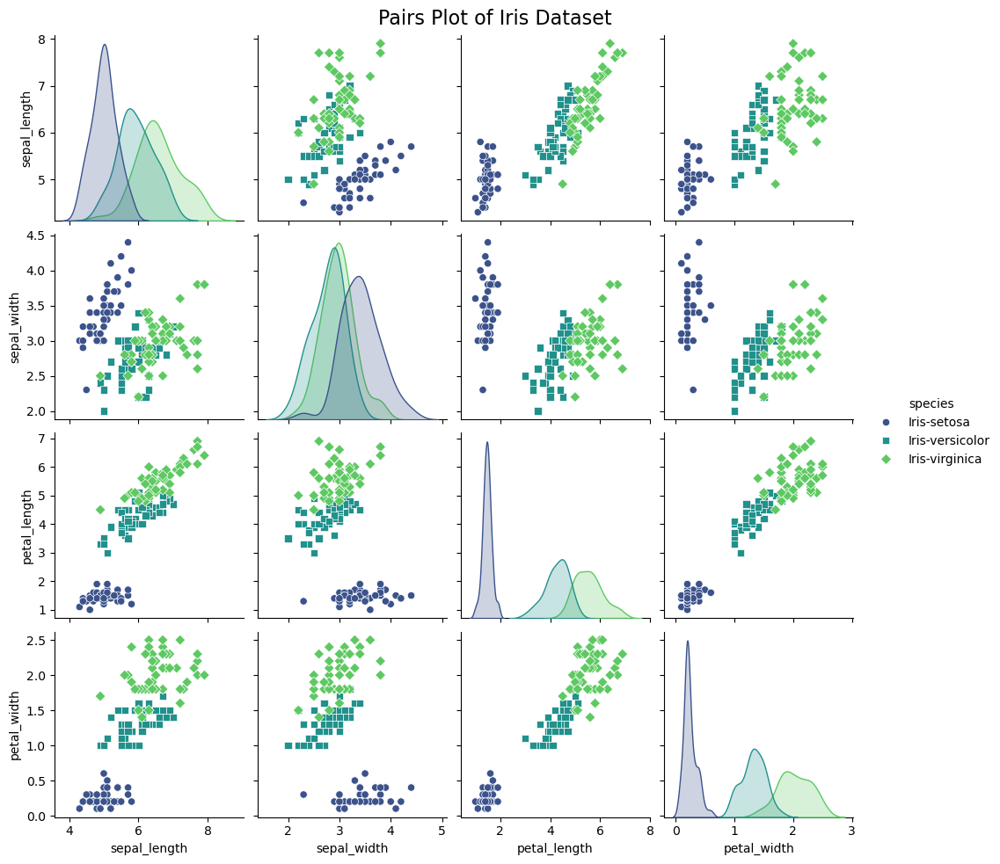
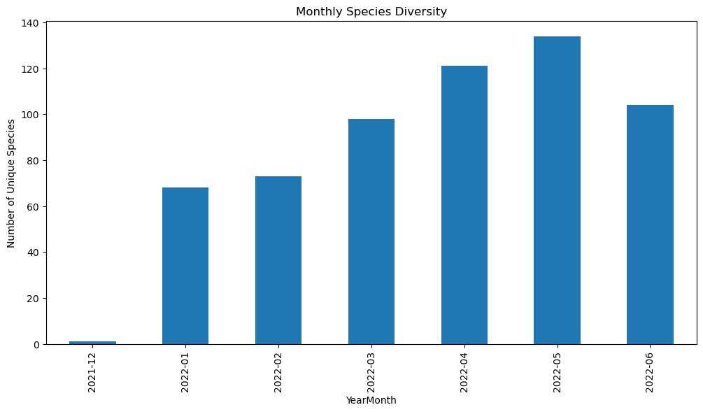

# Hw3

## 1. IRIS Data Analysis

### Let's begin with loading and taking a quick look at the data, this will help us create the graph.


```python
import pandas as pd
import matplotlib.pyplot as plt
import seaborn as sns

# Load the IRIS dataset
iris_data_path = '/home/xyc/Downloads/hw3/IRIS.csv'
iris_data = pd.read_csv(iris_data_path)

# Display the first few rows of the dataset to understand its structure
iris_data.head()

```


<div>
<style scoped>
    .dataframe tbody tr th:only-of-type {
        vertical-align: middle;
    }

    .dataframe tbody tr th {
        vertical-align: top;
    }

    .dataframe thead th {
        text-align: right;
    }
</style>
<table border="1" class="dataframe">
  <thead>
    <tr style="text-align: right;">
      <th></th>
      <th>sepal_length</th>
      <th>sepal_width</th>
      <th>petal_length</th>
      <th>petal_width</th>
      <th>species</th>
    </tr>
  </thead>
  <tbody>
    <tr>
      <th>0</th>
      <td>5.1</td>
      <td>3.5</td>
      <td>1.4</td>
      <td>0.2</td>
      <td>Iris-setosa</td>
    </tr>
    <tr>
      <th>1</th>
      <td>4.9</td>
      <td>3.0</td>
      <td>1.4</td>
      <td>0.2</td>
      <td>Iris-setosa</td>
    </tr>
    <tr>
      <th>2</th>
      <td>4.7</td>
      <td>3.2</td>
      <td>1.3</td>
      <td>0.2</td>
      <td>Iris-setosa</td>
    </tr>
    <tr>
      <th>3</th>
      <td>4.6</td>
      <td>3.1</td>
      <td>1.5</td>
      <td>0.2</td>
      <td>Iris-setosa</td>
    </tr>
    <tr>
      <th>4</th>
      <td>5.0</td>
      <td>3.6</td>
      <td>1.4</td>
      <td>0.2</td>
      <td>Iris-setosa</td>
    </tr>
  </tbody>
</table>
</div>


### Now we can create visualizations to analyze the data.
#### the task that were given are: 
#### 1. A figure exploring the relationship between sepal and petal dimensions
#### 2. A boxplot showing the distribution of sepal and petal dimensions.
#### 3. A pairs-plot to quickly analyze relationships between the data.

### let's begin with 1 :


```python
# Creating two scatter plots to explore the relationship between sepal and petal dimensions
plt.figure(figsize=(12, 6))

# Scatter plot for sepal length vs petal length
plt.subplot(1, 2, 1)
sns.scatterplot(data=iris_data, x="sepal_length", y="petal_length", hue="species", style="species", palette="inferno") # palette can change color
plt.title('Sepal Length vs Petal Length')
plt.xlabel('Sepal Length (cm)')
plt.ylabel('Petal Length (cm)')

# Scatter plot for sepal width vs petal width
plt.subplot(1, 2, 2)
sns.scatterplot(data=iris_data, x="sepal_width", y="petal_width", hue="species", style="species", palette="inferno")
plt.title('Sepal Width vs Petal Width')
plt.xlabel('Sepal Width (cm)')
plt.ylabel('Petal Width (cm)')

# Display the plots
plt.show()

```


    

    


Graph seems to be correct, let's begin with analysis.
1. Sepal Length and Petal Length: There is a strong, positive correlation between sepal length and petal length. As the sepal length increases, the petal length also tends to increase. This trend is consistent across the different species, but each species clusters in its unique range, indicating species-specific size characteristics.

2. Sepal Width and Petal Width: The relationship here is less pronounced than the first, but there still appears to be a positive correlation between sepal width and petal width. The species-specific clustering is also evident in this plot, but the overlap between species is more noticeable, especially between Iris-versicolor and Iris-virginica.

Overall, these relationships suggest that larger irises tend to have larger sepals and petals, both in length and width. However, the degree of this size relationship varies among the species, with each species displaying its characteristic range of dimensions.

### Here is task 2 :


```python
# Setting up the matplotlib figure
fig, axes = plt.subplots(2, 2, figsize=(15, 10))

# Plotting boxplots for sepal width and sepal length by species
sns.boxplot(ax=axes[0, 0], data=iris_data, x='species', y='sepal_width', palette="Set2")
sns.boxplot(ax=axes[0, 1], data=iris_data, x='species', y='sepal_length', palette="Set2")

# Plotting boxplots for petal width and petal length by species
sns.boxplot(ax=axes[1, 0], data=iris_data, x='species', y='petal_width', palette="Set2")
sns.boxplot(ax=axes[1, 1], data=iris_data, x='species', y='petal_length', palette="Set2")

# Setting titles for each subplot
axes[0, 0].set_title('Boxplot of Sepal Width by Species')
axes[0, 1].set_title('Boxplot of Sepal Length by Species')
axes[1, 0].set_title('Boxplot of Petal Width by Species')
axes[1, 1].set_title('Boxplot of Petal Length by Species')

# Adjusting layout
plt.tight_layout()

# Displaying the plots
plt.show()
```

    /tmp/ipykernel_2851/2900182027.py:5: FutureWarning: 
    
    Passing `palette` without assigning `hue` is deprecated and will be removed in v0.14.0. Assign the `x` variable to `hue` and set `legend=False` for the same effect.
    
      sns.boxplot(ax=axes[0, 0], data=iris_data, x='species', y='sepal_width', palette="Set2")
    /tmp/ipykernel_2851/2900182027.py:6: FutureWarning: 
    
    Passing `palette` without assigning `hue` is deprecated and will be removed in v0.14.0. Assign the `x` variable to `hue` and set `legend=False` for the same effect.
    
      sns.boxplot(ax=axes[0, 1], data=iris_data, x='species', y='sepal_length', palette="Set2")
    /tmp/ipykernel_2851/2900182027.py:9: FutureWarning: 
    
    Passing `palette` without assigning `hue` is deprecated and will be removed in v0.14.0. Assign the `x` variable to `hue` and set `legend=False` for the same effect.
    
      sns.boxplot(ax=axes[1, 0], data=iris_data, x='species', y='petal_width', palette="Set2")
    /tmp/ipykernel_2851/2900182027.py:10: FutureWarning: 
    
    Passing `palette` without assigning `hue` is deprecated and will be removed in v0.14.0. Assign the `x` variable to `hue` and set `legend=False` for the same effect.
    
      sns.boxplot(ax=axes[1, 1], data=iris_data, x='species', y='petal_length', palette="Set2")


    

    


seems to be correct, let's begin with analysis.

Sepal Width and Length: There is variation among the species in both sepal width and length. Iris-setosa tends to have a wider sepal but not necessarily the longest, suggesting it may have a more rounded sepal shape.

Petal Width and Length: The differences are more pronounced in petal measurements. Iris-setosa has the smallest petal length and width, indicating it has significantly smaller petals than the other two species.

Species Differentiation: The overlap in the boxplot ranges for Iris-versicolor and Iris-virginica suggests that these species are more similar to each other in terms of sepal and petal dimensions compared to Iris-setosa, which is distinctly different.

There are a few outliers, particularly in sepal width for Iris-versicolor and Iris-virginica, which may indicate some variation within these species or potential data errors.

### Here is task 3 ：


```python
# Creating a pairs plot for the iris dataset
sns.pairplot(iris_data, hue="species", palette="viridis", markers=["o", "s", "D"])

# Adding a title
plt.suptitle('Pairs Plot of Iris Dataset', size=16)
plt.subplots_adjust(top=0.95)  # Adjusting title position

# Display the plot
plt.show()

```


    

    


Sepal Length and Width: These two dimensions show a less distinct correlation. The species seem to cluster separately, particularly Iris-setosa, which tends to have shorter and wider sepals.

Petal Length and Width: There is a strong positive correlation between petal length and width across all species. This relationship is more linear and distinct, indicating that as petal length increases, petal width also tends to increase.

Sepal and Petal Dimensions: When comparing sepal dimensions (length and width) with petal dimensions (length and width), there is a noticeable trend where Iris-setosa again clusters separately, typically with smaller petal lengths and widths. The other two species show more overlap but still distinguishable based on these dimensions.

Species Distinction: The plot effectively separates the three species, especially Iris-setosa, which is distinct in its characteristics. Iris-versicolor and Iris-virginica show some overlap but can be distinguished based on a combination of these four dimensions.

the pairs-plot reveals intricate relationships and distinctions among the three species of the iris flower based on their sepal and petal measurements.


```python

```

## 2. Birdwatching Data Analysis

### Data Analysis Tasks are: 
#### 1. Identify the most prevalent bird species.
#### 2. Analyze the monthly distribution of the top 3 most prevalent species.
#### 3. Determine the rarest species.

#### Task 1, Identify the most prevalent bird species.


```python
import pandas as pd

# Load the dataset to examine its contents
file_path = '/home/xyc/Downloads/hw3/artportalen.csv'
data = pd.read_csv(file_path)

# Display the first few rows of the dataset to get an overview
data.head()


# Analyzing the dataset to find the most prevalent bird species

# Convert the 'Antal' column to numeric, assuming it represents the number of individuals observed
data['Antal'] = pd.to_numeric(data['Antal'], errors='coerce')

# Group by species and sum the number of individuals observed for each species
species_counts = data.groupby('Artnamn')['Antal'].sum()

# Sort the species by the total count to find the most prevalent species
most_prevalent_species = species_counts.sort_values(ascending=False)
most_prevalent_species.head()

```


    Artnamn
    Grönsiska        20211.0
    Sothöna           8308.0
    Gräsand           7167.0
    Storskrake        6750.0
    Vitkindad gås     6345.0
    Name: Antal, dtype: float64


According to the data.
1. Grönsiska  - 20,211
2. Sothöna  - 8,308
3. Gräsand  - 7,167
4. Storskrake - 6750
5. Vitkindad gås - 6345


#### Task 2, Analyze the monthly distribution of the top 3 most prevalent species.


```python
import matplotlib.pyplot as plt

# Extracting the top 3 most prevalent species from the previous result
top_3_species = most_prevalent_species.head(3).index

# Filtering the dataset to include only these species
top_3_species_data = data[data['Artnamn'].isin(top_3_species)]

# Extracting the month from the 'Startdatum' column
top_3_species_data['Month'] = pd.to_datetime(top_3_species_data['Startdatum']).dt.month

# Grouping by species and month, then summing the number of individuals observed
monthly_distribution = top_3_species_data.groupby(['Artnamn', 'Month'])['Antal'].sum().unstack(fill_value=0)

# Plotting the monthly distribution
plt.figure(figsize=(12, 8))
for species in top_3_species:
    monthly_distribution.loc[species].plot(label=species)
plt.title('Monthly Distribution of Top 3 Most Prevalent Species')
plt.xlabel('Month')
plt.ylabel('Number of Individuals Observed')
plt.legend(title='Species')
plt.xticks(range(1, 13), ['Jan', 'Feb', 'Mar', 'Apr', 'May', 'Jun', 'Jul', 'Aug', 'Sep', 'Oct', 'Nov', 'Dec'])
plt.grid(True)
plt.show()


```

    /tmp/ipykernel_2851/4159927595.py:10: SettingWithCopyWarning: 
    A value is trying to be set on a copy of a slice from a DataFrame.
    Try using .loc[row_indexer,col_indexer] = value instead
    
    See the caveats in the documentation: https://pandas.pydata.org/pandas-docs/stable/user_guide/indexing.html#returning-a-view-versus-a-copy
      top_3_species_data['Month'] = pd.to_datetime(top_3_species_data['Startdatum']).dt.month


    

    


The monthly distribution of the top 3 most prevalent bird species in the Royal National Park in 2022 is illustrated in the graph. The species are:

1. Grönsiska : Shows a significant peak in the early months of the year, particularly in February and March, with a notable decline afterwards.
2. Sothöna : Exhibits a more consistent presence throughout the year, with slightly higher numbers observed in the middle months (May to August).
3. Gräsand : Similar to the Sothöna, the Gräsand displays a fairly consistent presence across the year, with a slight increase in the warmer months (especially in May).

These patterns reflect the seasonal behavior and possibly migration patterns of these species 


#### Task3, Determine the rarest species.


```python
#  find the rarest species
rarest_species = data.groupby('Artnamn')['Antal'].sum().sort_values().head(4)
rarest_species


```


    Artnamn
    Ob. korsnäbb    0.0
    Fjällvråk       1.0
    Lappsparv       1.0
    Varfågel        1.0
    Name: Antal, dtype: float64


Here are rarest species as listed

### Generate at least 3 questions:


1. Which month has the highest overall bird sightings?
2. Are there species that are exclusively sighted in a particular month?
3. How does the diversity of species vary by month?


```python
# 1. Which month has the highest overall bird sightings?

# Summing the number of individuals observed by month
monthly_total_sightings = data.groupby(data['Startdatum'].str[:7])['Antal'].sum()

# Identifying the month with the highest overall bird sightings
month_with_highest_sightings = monthly_total_sightings.idxmax()

# 2. Are there species that are exclusively sighted in a particular month?

# Extracting the month and year from the 'Startdatum' column
data['YearMonth'] = pd.to_datetime(data['Startdatum']).dt.to_period('M')

# Grouping by species and month, and counting the number of sightings
species_monthly_presence = data.groupby(['Artnamn', 'YearMonth']).size().unstack(fill_value=0)

# Identifying species that are exclusively sighted in a particular month
exclusive_species_by_month = species_monthly_presence[(species_monthly_presence > 0).sum(axis=1) == 1]

# 3. How does the diversity of species vary by month?

# Counting the number of unique species observed each month
monthly_species_diversity = data.groupby('YearMonth')['Artnamn'].nunique()

month_with_highest_sightings, exclusive_species_by_month, monthly_species_diversity.plot(kind='bar', figsize=(12, 6), title='Monthly Species Diversity', ylabel='Number of Unique Species')

```


    ('2022-01',
     YearMonth                  2021-12  2022-01  2022-02  2022-03  2022-04  \
     Artnamn                                                                  
     Bivråk                           0        0        0        0        0   
     Buskskvätta                      0        0        0        0        0   
     Bändelkorsnäbb                   0        0        0        1        0   
     Doppingfåglar                    0        0        0        0        1   
     Ejder                            0        0        0        0        0   
     Europeisk skata                  0        0        0        0        2   
     Fiskgjuse                        0        0        0        0        1   
     Fjällvråk                        0        0        1        0        0   
     Forsärla                         0        0        0        1        0   
     Gravand                          0        0        0        0        0   
     Gråhakedopping                   0        0        0        0        1   
     Grönbena                         0        0        0        0        0   
     Gulärla                          0        0        0        0        0   
     Göktyta                          0        0        0        0        0   
     Hussvala                         0        0        0        0        0   
     Knipskrake                       0        0        0        0        1   
     Kungsfiskare                     0        0        0        0       59   
     Kustlabb                         0        0        0        0        0   
     Kärrsångare                      0        0        0        0        0   
     Lappsparv                        0        0        0        0        0   
     Ljungpipare                      0        0        0        0        1   
     Lärkfalk                         0        0        0        0        0   
     Mellanskarv                      0        0        0        0        0   
     Måsfåglar                        0        0        0        0        0   
     Nordlig gulärla                  0        0        0        0        0   
     Nordsjösilltrut                  0        0        0        2        0   
     Ob. bo-/bergfink                 0        0        0        0        1   
     Ob. fisk-/silvertärna            0        0        0        0        0   
     Ob. gås                          0        0        0        1        0   
     Ob. korsnäbb                     0        1        0        0        0   
     Ob. skarv                        0        0        0        0        2   
     Ormvråk, underarten buteo        0        0        0        1        0   
     Prutgås                          0        0        0        0        0   
     Rosenfink                        0        0        0        0        0   
     Röd glada                        0        0        0        1        0   
     Rödbena                          0        0        0        0        0   
     Silvertärna                      0        0        0        0        0   
     Spetsbergsgås                    0        0        0        0        1   
     Spillkråka                       0        0        0        1        0   
     Stenfalk                         0        0        0        0        2   
     Storlom                          0        0        0        0        0   
     Strömstare                       0        1        0        0        0   
     Tornfalk                         0        0        0        0        1   
     Trädlärka                        0        0        0        1        0   
     Tundrasädgås                     0        0        0        0        1   
     Varfågel                         0        0        0        0        0   
     Vinterhämpling                   0        0        0        0        1   
     Ägretthäger                      0        0        0        0        0   
     
     YearMonth                  2022-05  2022-06  
     Artnamn                                      
     Bivråk                           1        0  
     Buskskvätta                      6        0  
     Bändelkorsnäbb                   0        0  
     Doppingfåglar                    0        0  
     Ejder                            1        0  
     Europeisk skata                  0        0  
     Fiskgjuse                        0        0  
     Fjällvråk                        0        0  
     Forsärla                         0        0  
     Gravand                          1        0  
     Gråhakedopping                   0        0  
     Grönbena                        13        0  
     Gulärla                          3        0  
     Göktyta                          4        0  
     Hussvala                         4        0  
     Knipskrake                       0        0  
     Kungsfiskare                     0        0  
     Kustlabb                         1        0  
     Kärrsångare                      0        6  
     Lappsparv                        1        0  
     Ljungpipare                      0        0  
     Lärkfalk                         2        0  
     Mellanskarv                      1        0  
     Måsfåglar                        0        1  
     Nordlig gulärla                  1        0  
     Nordsjösilltrut                  0        0  
     Ob. bo-/bergfink                 0        0  
     Ob. fisk-/silvertärna            1        0  
     Ob. gås                          0        0  
     Ob. korsnäbb                     0        0  
     Ob. skarv                        0        0  
     Ormvråk, underarten buteo        0        0  
     Prutgås                          1        0  
     Rosenfink                        1        0  
     Röd glada                        0        0  
     Rödbena                          1        0  
     Silvertärna                      2        0  
     Spetsbergsgås                    0        0  
     Spillkråka                       0        0  
     Stenfalk                         0        0  
     Storlom                          1        0  
     Strömstare                       0        0  
     Tornfalk                         0        0  
     Trädlärka                        0        0  
     Tundrasädgås                     0        0  
     Varfågel                         1        0  
     Vinterhämpling                   0        0  
     Ägretthäger                      1        0  ,
     <Axes: title={'center': 'Monthly Species Diversity'}, xlabel='YearMonth', ylabel='Number of Unique Species'>)


    

    


1. Month with the Highest Overall Bird Sightings: The month with the highest overall number of bird sightings in 2022 was January.

2. Species Exclusively Sighted in a Particular Month: There are several species that were exclusively sighted in a particular month. Here are a few examples:

Bändelkorsnäbb was only sighted in February.
Doppingfåglar was exclusively sighted in April.
Kungsfiskare had sightings only in April.
(note， this list includes only a few examples. The dataset contains more species with exclusive sightings in specific months.)

3. Variation of Species Diversity by Month: The bar chart shows how the diversity of species varied by month throughout the year. There's a noticeable trend where species diversity tends to be higher during the warmer months (from April to September) compared to the colder months. This pattern may be influenced by factors such as migration patterns and breeding seasons.


```python

```

## 3. Predicting Strokes

Your task is to explore this dataset on your own. Where does your exploration lead you? What can you say about the dataset? Explain the content of the dataset and generate at least 3 serious questions that give you insight.


### Where does your exploration lead you? What can you say about the dataset?

The dataset stroke-data.csv encompasses a range of data pertaining to stroke incidents in individuals, encompassing a variety of demographic and health-related characteristics. In this analysis, we aim to delve into this dataset, formulating insightful questions and seeking answers through data exploration and analysis.

### Generate at least 3 serious questions that give you insight.

#### 1. How does the incidence of stroke vary across different age groups, and how does this variation differ between individuals with and without hypertension?


```python
import numpy as np

stroke_data_path = '/home/xyc/Downloads/hw3/stroke-data.csv'
stroke_data = pd.read_csv(stroke_data_path)

# Create age groups for better visualization
bins = [0, 18, 30, 45, 60, 75, 90]
labels = ['0-18', '19-30', '31-45', '46-60', '61-75', '76-90']
stroke_data['age_group'] = pd.cut(stroke_data['age'], bins=bins, labels=labels, right=False)

# Grouping the data by age group and hypertension, and calculating the stroke rate
stroke_rate = stroke_data.groupby(['age_group', 'hypertension'])['stroke'].mean().unstack()

# Plotting
plt.figure(figsize=(12, 6))
stroke_rate.plot(kind='bar', color=['skyblue', 'salmon'], width=0.8)
plt.title('Stroke Incidence by Age Group and Hypertension Status')
plt.xlabel('Age Group')
plt.ylabel('Proportion of Individuals with Stroke')
plt.xticks(rotation=45)
plt.legend(title='Hypertension', labels=['No Hypertension', 'Hypertension'])
plt.show()


```

    /tmp/ipykernel_2851/11376172.py:12: FutureWarning: The default of observed=False is deprecated and will be changed to True in a future version of pandas. Pass observed=False to retain current behavior or observed=True to adopt the future default and silence this warning.
      stroke_rate = stroke_data.groupby(['age_group', 'hypertension'])['stroke'].mean().unstack()


    <Figure size 1200x600 with 0 Axes>


    

    


The graph illustrates the incidence of stroke across different age groups, differentiated by hypertension status (individuals with and without hypertension). Key observations from the graph include:

1. Age Group Influence: The proportion of individuals who have had a stroke increases with age across all age groups, which aligns with our earlier analysis indicating that age is a significant factor in stroke risk.

2. Impact of Hypertension: For almost every age group, individuals with hypertension have a higher proportion of stroke incidents compared to those without hypertension. This suggests that hypertension is a significant risk factor for stroke.

3. Most Affected Groups: The highest proportions of stroke are observed in the oldest age groups (61-75 and 76-90), especially among those with hypertension. This highlights the combined impact of aging and hypertension on stroke risk.


This graph effectively visualizes the combined effect of age and hypertension on stroke incidence, supporting the hypothesis that both factors are crucial in assessing stroke risk.

#### 2. How does the average glucose level vary among different age groups, and is there a noticeable difference in glucose levels between individuals who have had a stroke and those who have not?


```python
# Grouping the data by age group and stroke status, and calculating the mean average glucose level
avg_glucose_by_age_stroke = stroke_data.groupby(['age_group', 'stroke'])['avg_glucose_level'].mean().unstack()

# Plotting
plt.figure(figsize=(12, 6))
avg_glucose_by_age_stroke.plot(kind='bar', color=['lightgreen', 'darkgreen'], width=0.8)
plt.title('Average Glucose Level by Age Group and Stroke Status')
plt.xlabel('Age Group')
plt.ylabel('Average Glucose Level')
plt.xticks(rotation=45)
plt.legend(title='Stroke', labels=['No Stroke', 'Stroke'])
plt.show()

```

    /tmp/ipykernel_2851/4053937123.py:2: FutureWarning: The default of observed=False is deprecated and will be changed to True in a future version of pandas. Pass observed=False to retain current behavior or observed=True to adopt the future default and silence this warning.
      avg_glucose_by_age_stroke = stroke_data.groupby(['age_group', 'stroke'])['avg_glucose_level'].mean().unstack()


    <Figure size 1200x600 with 0 Axes>


    

    


The graph visualizes the average glucose level across different age groups, comparing individuals who have had a stroke with those who haven't. Key observations include:

1. Age-Related Trends: The average glucose level tends to increase with age across both groups (those who have had a stroke and those who haven't). This suggests a general trend of higher glucose levels in older age groups.

2. Stroke vs. No Stroke: In nearly all age groups, individuals who have experienced a stroke have higher average glucose levels compared to those who have not. This is particularly noticeable in the middle to older age groups.

3. Most Significant Differences: The largest disparities in average glucose levels between stroke and no-stroke individuals are observed in the age groups '46-60' and '61-75'. This indicates that elevated glucose levels in these age groups might be more strongly associated with stroke incidence.

This graph provides insights into how average glucose levels, a potential risk factor for stroke, vary across different age groups and in relation to stroke incidence, supporting the idea that monitoring glucose levels, especially in middle-aged to older adults, could be crucial for stroke prevention and risk assessment.

#### 3. What is the most common work type among the youngest and oldest age groups, and how does it differ between individuals who have and have not had a stroke?


```python
# Filtering data for the youngest (0-18) and oldest (76-90) age groups
youngest_oldest_data = stroke_data[stroke_data['age_group'].isin(['0-18', '76-90'])]

# Grouping the data by age group, work type, and stroke status, and counting the number of individuals
work_type_distribution = youngest_oldest_data.groupby(['age_group', 'work_type', 'stroke']).size().unstack().fillna(0)

# Plotting
fig, axes = plt.subplots(nrows=1, ncols=2, figsize=(14, 6), sharey=True)

work_type_distribution.xs('0-18', level='age_group').plot(kind='bar', ax=axes[0], color=['royalblue', 'tomato'])
axes[0].set_title('Work Type in Age Group 0-18')
axes[0].set_xlabel('Work Type')
axes[0].set_ylabel('Number of Individuals')
axes[0].legend(title='Stroke', labels=['No Stroke', 'Stroke'])

work_type_distribution.xs('76-90', level='age_group').plot(kind='bar', ax=axes[1], color=['royalblue', 'tomato'])
axes[1].set_title('Work Type in Age Group 76-90')
axes[1].set_xlabel('Work Type')
axes[1].legend(title='Stroke', labels=['No Stroke', 'Stroke'])

plt.tight_layout()
plt.show()

```

    /tmp/ipykernel_2851/3787089419.py:5: FutureWarning: The default of observed=False is deprecated and will be changed to True in a future version of pandas. Pass observed=False to retain current behavior or observed=True to adopt the future default and silence this warning.
      work_type_distribution = youngest_oldest_data.groupby(['age_group', 'work_type', 'stroke']).size().unstack().fillna(0)


    

    


The graph illustrates the distribution of work types among the youngest (0-18 years) and oldest (76-90 years) age groups, comparing individuals based on their stroke status. Some interesting observations:

1. Youngest Age Group (0-18):

The dominant work type is 'children', indicating that most individuals in this age group are not yet part of the workforce, as expected.
The occurrence of stroke in this age group is very low, with a few cases across different work types.

2. Oldest Age Group (76-90):

The most common work types are 'Private', 'Self-employed', and 'Govt_job', although these numbers are low, reflecting retirement or reduced workforce participation in this age group.
Interestingly, there are still individuals in this age group actively engaged in various types of work, despite their advanced age.
The incidence of stroke is higher in this age group compared to the youngest group, which is consistent with the general trend of increased stroke risk with age.

This comparison sheds light on the work life at different ends of the age spectrum and how it correlates, albeit loosely, with health outcomes like stroke. ​​


```python

```
