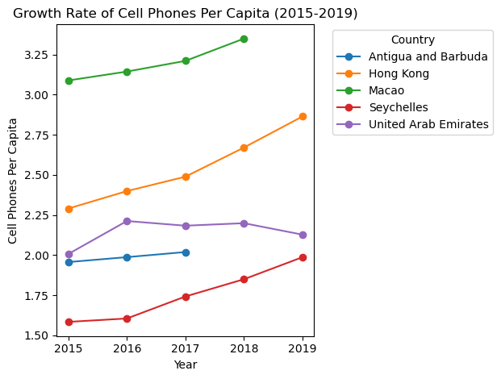

# HW4

## Introduction
In this assigment, the task is to analyse the number of cell phones in countries and how they relate to population size. The data is fraught with missing values and spread out into different files. Your task is to clean, combine and present the data.

## Data Loading


```python
# Data Loading
import pandas as pd
import numpy as np 

# Load Population Data
pop_data = pd.read_csv('/home/xyc/Downloads/HW4/pop_data.csv')
# Load Cell Phone Data
cell_phone_data = pd.read_csv('/home/xyc/Downloads/HW4/cell_phones_total.csv')
# Load Country Mapping Data
country_data = pd.read_csv('/home/xyc/Downloads/HW4/country_data.csv')

# Display the first few rows of each dataset
#pop_data.head()
#cell_phone_data.head()
#country_data.head()

```

## Data Cleaning and Preparation

### Cell Phone Data

#### Part 1 Handle Non-Numerical Values: 


```python
# Redefining the convert_to_numeric function
def convert_to_numeric(value):
    if isinstance(value, str):
        if value.endswith('k'):
            return float(value.replace('k', '')) * 1e3
        elif value.endswith('M'):
            return float(value.replace('M', '')) * 1e6
        elif value.endswith('B'):
            return float(value.replace('B', '')) * 1e9
    return value

# Convert the non-numeric columns ('k', 'M', 'B') to numeric for years 1980 onwards
for col in cell_phones_data.columns[17:]:  # Columns from 1980 onwards
    cell_phones_data[col] = cell_phones_data[col].apply(convert_to_numeric)


```

#### Part2 Handle Missing Values: 


```python
# Forward fill: Propagate last valid observation forward to next valid
cell_phones_filled = cell_phones_data.ffill(axis=1)

# Check the dataframe after forward fill
cell_phones_filled.head()
# Calculate the median for each column from 1980 onwards, excluding non-numeric data
median_values = cell_phones_filled.iloc[:, 17:].select_dtypes(include=[np.number]).median()

# Apply the median fill
cell_phones_filled.iloc[:, 17:] = cell_phones_filled.iloc[:, 17:].fillna(median_values)

# Check the dataframe after median fill
cell_phones_filled.head()
# Dropping any remaining missing values (rows that were entirely NaN) from 1980 onwards
cell_phones_filled = cell_phones_filled.dropna(subset=cell_phones_data.columns[17:])

# Check the dataframe after dropping rows
cell_phones_filled.head()

# Ensure all values in the year 2015 are numeric
cell_phones_filled['2015'] = pd.to_numeric(cell_phones_filled['2015'], errors='coerce')

# Attempt to sort the data by the number of cell phones in 2015 again
sorted_data_2015 = cell_phones_filled.sort_values(by='2015', ascending=False)

# Display the sorted data
sorted_data_2015.head()

```


<div>
<style scoped>
    .dataframe tbody tr th:only-of-type {
        vertical-align: middle;
    }

    .dataframe tbody tr th {
        vertical-align: top;
    }

    .dataframe thead th {
        text-align: right;
    }
</style>
<table border="1" class="dataframe">
  <thead>
    <tr style="text-align: right;">
      <th></th>
      <th>iso-3</th>
      <th>1960</th>
      <th>1965</th>
      <th>1966</th>
      <th>1967</th>
      <th>1968</th>
      <th>1969</th>
      <th>1970</th>
      <th>1971</th>
      <th>1972</th>
      <th>...</th>
      <th>2010</th>
      <th>2011</th>
      <th>2012</th>
      <th>2013</th>
      <th>2014</th>
      <th>2015</th>
      <th>2016</th>
      <th>2017</th>
      <th>2018</th>
      <th>2019</th>
    </tr>
  </thead>
  <tbody>
    <tr>
      <th>35</th>
      <td>CHN</td>
      <td>0.0</td>
      <td>0.0</td>
      <td>0.0</td>
      <td>0.0</td>
      <td>0.0</td>
      <td>0.0</td>
      <td>0.0</td>
      <td>0.0</td>
      <td>0.0</td>
      <td>...</td>
      <td>859000000.0</td>
      <td>986000000.0</td>
      <td>1110000000.0</td>
      <td>1230000000.0</td>
      <td>1290000000.0</td>
      <td>1.290000e+09</td>
      <td>1360000000.0</td>
      <td>1470000000.0</td>
      <td>1650000000.0</td>
      <td>1730000000.0</td>
    </tr>
    <tr>
      <th>87</th>
      <td>IND</td>
      <td>0.0</td>
      <td>0.0</td>
      <td>0.0</td>
      <td>0.0</td>
      <td>0.0</td>
      <td>0.0</td>
      <td>0.0</td>
      <td>0.0</td>
      <td>0.0</td>
      <td>...</td>
      <td>752000000.0</td>
      <td>894000000.0</td>
      <td>865000000.0</td>
      <td>886000000.0</td>
      <td>944000000.0</td>
      <td>1.000000e+09</td>
      <td>1130000000.0</td>
      <td>1170000000.0</td>
      <td>1180000000.0</td>
      <td>1150000000.0</td>
    </tr>
    <tr>
      <th>200</th>
      <td>USA</td>
      <td>0.0</td>
      <td>0.0</td>
      <td>0.0</td>
      <td>0.0</td>
      <td>0.0</td>
      <td>0.0</td>
      <td>0.0</td>
      <td>0.0</td>
      <td>0.0</td>
      <td>...</td>
      <td>285000000.0</td>
      <td>297000000.0</td>
      <td>305000000.0</td>
      <td>311000000.0</td>
      <td>356000000.0</td>
      <td>3.820000e+08</td>
      <td>396000000.0</td>
      <td>400000000.0</td>
      <td>422000000.0</td>
      <td>422000000.0</td>
    </tr>
    <tr>
      <th>86</th>
      <td>IDN</td>
      <td>0.0</td>
      <td>0.0</td>
      <td>0.0</td>
      <td>0.0</td>
      <td>0.0</td>
      <td>0.0</td>
      <td>0.0</td>
      <td>0.0</td>
      <td>0.0</td>
      <td>...</td>
      <td>211000000.0</td>
      <td>250000000.0</td>
      <td>282000000.0</td>
      <td>313000000.0</td>
      <td>326000000.0</td>
      <td>3.390000e+08</td>
      <td>386000000.0</td>
      <td>435000000.0</td>
      <td>319000000.0</td>
      <td>345000000.0</td>
    </tr>
    <tr>
      <th>26</th>
      <td>BRA</td>
      <td>0.0</td>
      <td>0.0</td>
      <td>0.0</td>
      <td>0.0</td>
      <td>0.0</td>
      <td>0.0</td>
      <td>0.0</td>
      <td>0.0</td>
      <td>0.0</td>
      <td>...</td>
      <td>197000000.0</td>
      <td>234000000.0</td>
      <td>248000000.0</td>
      <td>271000000.0</td>
      <td>281000000.0</td>
      <td>2.580000e+08</td>
      <td>244000000.0</td>
      <td>218000000.0</td>
      <td>207000000.0</td>
      <td>207000000.0</td>
    </tr>
  </tbody>
</table>
<p>5 rows × 57 columns</p>
</div>


### Population Data


```python
# Remove 'Unnamed: 0' column
if 'Unnamed: 0' in pop_data.columns:
    pop_data.drop(columns=['Unnamed: 0'], inplace=True)
# Extracting numeric columns (excluding 'iso-3')
numeric_columns_pop = pop_data.drop(columns=['iso-3'])

# Apply forward fill and backward fill to numeric columns
numeric_columns_pop.ffill(axis=1, inplace=True)
numeric_columns_pop.bfill(axis=1, inplace=True)

# Combine the 'iso-3' column back with the filled numeric columns
pop_data_filled = pd.concat([pop_data['iso-3'], numeric_columns_pop], axis=1)

# Drop rows with any missing values (if any remain after filling)
pop_data_filled.dropna(inplace=True)

# Checking for any non-numeric data in the columns (excluding 'iso-3')
non_numeric_columns = pop_data_filled.select_dtypes(exclude=[np.number]).columns.tolist()

# Display any non-numeric columns found (other than 'iso-3')
print("Non-numeric columns found (excluding 'iso-3'):", non_numeric_columns)
```

    Non-numeric columns found (excluding 'iso-3'): ['iso-3']


### Country Mapping Data


```python
# Select only the relevant columns and create a copy
country_data_cleaned = country_data[['name', 'alpha-3']].copy()

# Check for missing values
missing_values = country_data_cleaned.isnull().sum()
print("Missing values in each column:\n", missing_values)

# Handle missing values if they exist
if missing_values.any():
    country_data_cleaned.dropna(inplace=True)

# Rename columns for clarity
country_data_cleaned.rename(columns={'name': 'country_name', 'alpha-3': 'iso-3'}, inplace=True)

# Display the cleaned data
print(country_data_cleaned.head())

```

    Missing values in each column:
     name       0
    alpha-3    0
    dtype: int64
         country_name iso-3
    0     Afghanistan   AFG
    1   Åland Islands   ALA
    2         Albania   ALB
    3         Algeria   DZA
    4  American Samoa   ASM


## Data Merging
In this section, we combine the cleaned datasets into a single dataset that allows for the analysis of cell phones per capita. This will involve the following steps:

1. **Transform to Long Format**: Both the cell phone and population datasets are currently in a wide format, where each column represents a year and each row a country. We will transform these datasets into a long format that will have columns for country, year, population, and cell phones.

2. **Merge Cell Phone and Population Data**: We'll merge the long-format cell phone data with the long-format population data on the 'iso-3' country codes and 'year'. This will give us a dataset that includes the number of cell phones and population size for each country-year pair.

3. **Add Country Names**: We will enhance the dataset by merging in the country names using the 'iso-3' codes, making our data more interpretable.

4. **Calculate Phones Per Capita**: After merging, we will calculate the number of phones per capita for each country-year pair.


### Step 1: Transform to Long Format


```python
cell_phones_long = cell_phones_data.melt(id_vars=['iso-3'], var_name='year', value_name='n_cellphones')
pop_data_long = pop_data_filled.melt(id_vars=['iso-3'], var_name='year', value_name='population')
# Convert 'year' to numeric for both datasets (if it's a string)
cell_phones_long['year'] = pd.to_numeric(cell_phones_long['year'], errors='coerce')
pop_data_long['year'] = pd.to_numeric(pop_data_long['year'], errors='coerce')

```

### Step 2: Merge Cell Phone and Population Data


```python
merged_data = pd.merge(cell_phones_long, pop_data_long, on=['iso-3', 'year'])

# Convert 'n_cellphones' and 'population' to numeric types, coercing any errors into NaN
merged_data['n_cellphones'] = pd.to_numeric(merged_data['n_cellphones'], errors='coerce')
merged_data['population'] = pd.to_numeric(merged_data['population'], errors='coerce')

# Drop any rows that have NaN values after this conversion
merged_data.dropna(subset=['n_cellphones', 'population'], inplace=True)

```

### Step 3: Calculate Phones Per Capita


```python
merged_data['phones_per_capita'] = merged_data['n_cellphones'] / merged_data['population']
```

### Step 4: Add Country Names and display table


```python
# Assuming 'country_data_cleaned' has been cleaned and has 'iso-3' and 'country_name' columns
final_data = pd.merge(merged_data, country_data_cleaned, on='iso-3', how='left')

# Display the table 
final_table = final_data[['iso-3', 'year', 'n_cellphones', 'population', 'phones_per_capita']]
final_table.head()
```


<div>
<style scoped>
    .dataframe tbody tr th:only-of-type {
        vertical-align: middle;
    }

    .dataframe tbody tr th {
        vertical-align: top;
    }

    .dataframe thead th {
        text-align: right;
    }
</style>
<table border="1" class="dataframe">
  <thead>
    <tr style="text-align: right;">
      <th></th>
      <th>iso-3</th>
      <th>year</th>
      <th>n_cellphones</th>
      <th>population</th>
      <th>phones_per_capita</th>
    </tr>
  </thead>
  <tbody>
    <tr>
      <th>0</th>
      <td>ABW</td>
      <td>1960</td>
      <td>0.0</td>
      <td>54608.0</td>
      <td>0.0</td>
    </tr>
    <tr>
      <th>1</th>
      <td>AFG</td>
      <td>1960</td>
      <td>0.0</td>
      <td>8622466.0</td>
      <td>0.0</td>
    </tr>
    <tr>
      <th>2</th>
      <td>AGO</td>
      <td>1960</td>
      <td>0.0</td>
      <td>5357195.0</td>
      <td>0.0</td>
    </tr>
    <tr>
      <th>3</th>
      <td>ALB</td>
      <td>1960</td>
      <td>0.0</td>
      <td>1608800.0</td>
      <td>0.0</td>
    </tr>
    <tr>
      <th>4</th>
      <td>AND</td>
      <td>1960</td>
      <td>0.0</td>
      <td>9443.0</td>
      <td>0.0</td>
    </tr>
  </tbody>
</table>
</div>


## Analysis
In this section, we will analyze the number of cell phones per capita across different countries. We will identify the countries with the highest number of cell phones per capita in the most recent year available (2019) and analyze the growth rate of cell phones per capita over the last 10 years.

### Identify Top Countries for Phones Per Capita in 2019


```python
# Specify the countries manually as per the instruction
specified_countries = ['Macao', 'Hong Kong', 'United Arab Emirates', 'Antigua and Barbuda', 'Seychelles']

# Filter the final_data to include only these specified countries
final_data_specified = final_data[final_data['country_name'].isin(specified_countries)]

# Pivot the table to have the specified countries as columns and years as rows for the phones per capita metric
specified_pivot_table = final_data_specified.pivot_table(index='year', columns='country_name', values='phones_per_capita')

# Instruction specifies data from 2015 to 2019, filter the years accordingly
specified_pivot_table = specified_pivot_table.loc['2015':'2019']

# Display the final table for specified countries
print(specified_pivot_table)

```

    country_name  Antigua and Barbuda  Hong Kong     Macao  Seychelles  \
    year                                                                 
    2015                     1.956838   2.290401  3.088231    1.584260   
    2016                     1.987545   2.398931  3.143510    1.605459   
    2017                     2.019337   2.488773  3.210102    1.742433   
    2018                          NaN   2.670209  3.348741    1.849900   
    2019                          NaN   2.863650       NaN    1.987196   
    
    country_name  United Arab Emirates  
    year                                
    2015                      2.007424  
    2016                      2.212521  
    2017                      2.183431  
    2018                      2.199084  
    2019                      2.127739  


### Growth Rate Analysis
We will now create a plot to illustrate the growth rate of cell phones per capita for these top countries over the last decade.


```python
import matplotlib.pyplot as plt

# Make sure this line matches the countries we manually specified earlier
specified_countries = ['Macao', 'Hong Kong', 'United Arab Emirates', 'Antigua and Barbuda', 'Seychelles']

# Filter the final_data to include only these specified countries
final_data_specified = final_data[final_data['country_name'].isin(specified_countries)]

# Pivot the table to have the specified countries as columns and years as rows for the phones per capita metric
specified_pivot_table = final_data_specified.pivot_table(index='year', columns='country_name', values='phones_per_capita')

# Since the instruction specifies data from 2015 to 2019, filter the years accordingly
specified_pivot_table = specified_pivot_table.loc['2015':'2019']

# Plot the data for these specified countries from 2015 to 2019
specified_pivot_table.plot(kind='line', marker='o')
plt.title('Growth Rate of Cell Phones Per Capita (2015-2019)')
plt.xlabel('Year')
plt.ylabel('Cell Phones Per Capita')
plt.legend(title='Country', bbox_to_anchor=(1.05, 1), loc='upper left')
plt.tight_layout()
plt.show()

```


    

    

