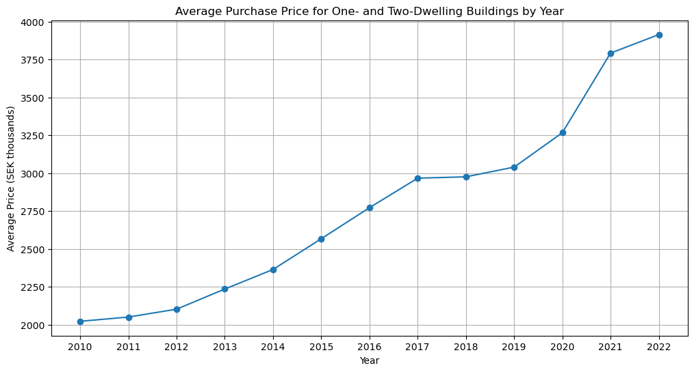
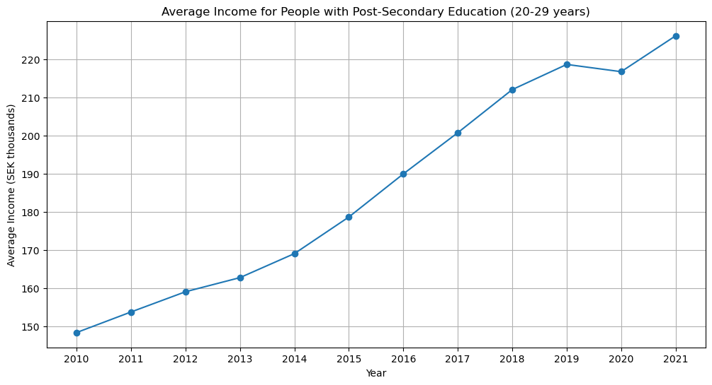
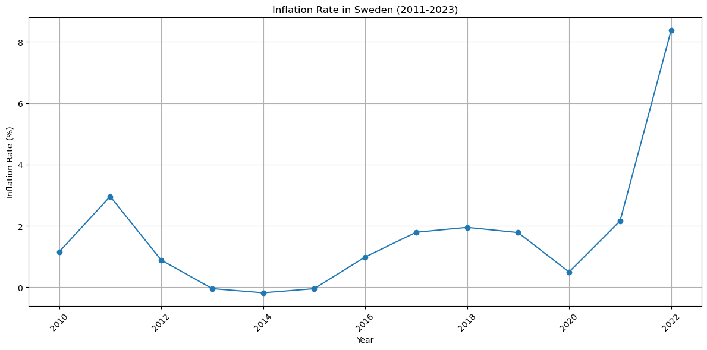
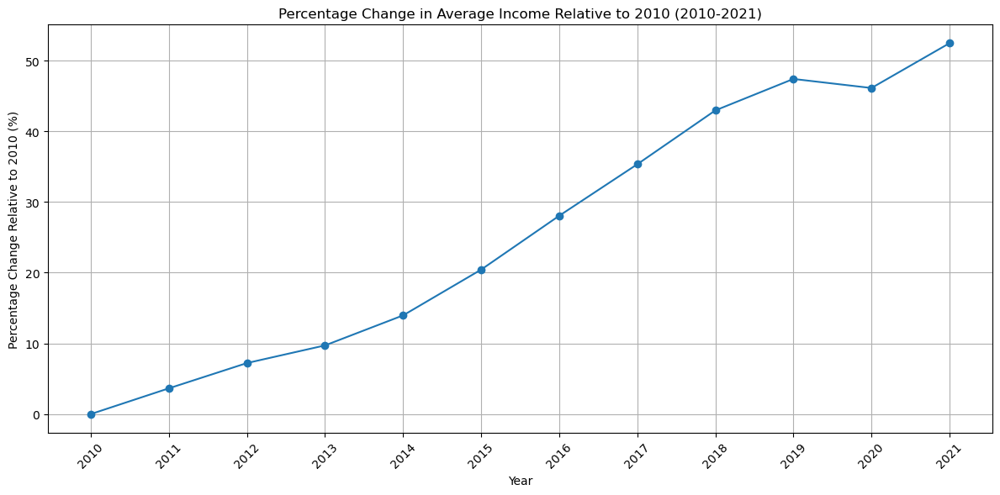

# How difficult is it to buy a residence nowadays with your salary after graduation compared to the past? 

Deadline: January 10th, 2024 at 18:00

Presentation: January 12th, 2024

## Abstract:

We are going to collect publicly accessible data from 2011-2022 for: 
 1. Rise of Avg house prices in sweden (yearly)
 2. Rise of Avg income in sweden (yearly)
 3. Rise of inflation rate in sweden (yearly)

Visualization of these data with help of python, we can get a rough idea of the relationship between income, inflation and housing price to determine whether or not if it is still the same difficulty to get a residence for people new to the society.

## Introduction:

In our current economic situation, the balance between earning and living has been substantially worse in the bad way( my own opinion), especially for those freshly stepping out of university halls. 

If we go back in time and take a look at the good old days(50-70s), one job could feed an entire family + one house. 
Nowadays even if you don't have a family, the loan of a two room apartment is probably gonna take you 30+ years to pay back.

This idea inspired me to make a visualization of avg housing prices, avg income and inflation rates data in Sweden from 2011 to 2021 into one graph with help of Python.

Although I have a negative attitude towards current economic situation, my prediction of the result is still somewhat optimistic, if politicians in this country did what they are paid for then we shouldn't see a too big of a gap between average income compared to average housing price.

Let's see whether or not I'm going to end up on the street in 2 years.


## Data : 


### Avg house prices : 


For the Rise of Avg house prices in sweden I found this from scb: 

https://www.statistikdatabasen.scb.se/pxweb/en/ssd/START__BO__BO0501__BO0501B/FastprisManadAr/

this website provide us with specific search filter.

option 1 allow us to choose observations: 
1. Purchase price, average in SEK thousands
2. Assessed value, average in SEK thousands
3. Purchase-price-coefficient

we choose 1 because it is more relevant for this project.

option 2 allow us to choose month of acquisition, we choses whole years

option 3 allow us to choose type of real estate:
1. one- and two-dwelling buildings
2. buildings for seasonal and secondary use
3. multi-dwelling and commercial buildings
4. manufacturers industries
5. agricultural real estates

we chooses 1 because it is more relevant for normal consumers.

option 4 allow us to choose years, we choose 2010-2022


In the end we were given a api so we can save this data


```python
import requests
import json

url = "https://api.scb.se/OV0104/v1/doris/en/ssd/START/BO/BO0501/BO0501B/FastprisManadAr"
json_query = {
    "query": [
        {"code": "Forvarvsmanad", "selection": {"filter": "item", "values": ["alla"]}},
        {"code": "Fastighetstyp", "selection": {"filter": "item", "values": ["1"]}},
        {"code": "ContentsCode", "selection": {"filter": "item", "values": ["BO0501I7"]}},
        {"code": "Tid", "selection": {"filter": "item", "values": [str(year) for year in range(2011, 2023)]}}
    ],
    "response": {"format": "px"}
}

response = requests.post(url, json=json_query)
data = response.text

# Save data to a file
with open('house_prices_data.px', 'w') as file:
    file.write(data)

'Data saved successfully.'

```


    'Data saved successfully.'


Due to we are given a .px file and standard pandas library does not have a direct function to read .px file, we convert the '.px' file to a more common format like CSV.

After doing some research I found out that we can use a online converter or using a specialized library called pyjstat. 

However due to the dataset is small and manageable, we could manually extract the data and make a csv file out of it, I used google drive spreadsheet to do this and saved as csv file.

Lets make a line plot of it


```python
import pandas as pd
import matplotlib.pyplot as plt

csv_file_path = 'Avg house prices in SEK thousands - Blad1.csv'

# Reading the CSV file
df = pd.read_csv(csv_file_path, index_col=0)

# Transposing the DataFrame to get years as rows
df = df.transpose()

# Resetting index to convert the years from index to a column
df.reset_index(inplace=True)
df.rename(columns={'index': 'Year', df.columns[1]: 'Price'}, inplace=True)

# Plotting the data
plt.figure(figsize=(12, 6))
plt.plot(df['Year'], df['Price'], marker='o')
plt.title('Average Purchase Price for One- and Two-Dwelling Buildings by Year')
plt.xlabel('Year')
plt.ylabel('Average Price (SEK thousands)')
plt.grid(True)
plt.xticks(df['Year'])  # Ensure all years are shown as x-ticks
plt.show()

```


    

    


### Avg income: 

After I did some digging, I found this avg income data from scb，

https://www.statistikdatabasen.scb.se/pxweb/en/ssd/START__HE__HE0110__HE0110A/SamForvInk1c/

Basically this data give us an insight of relationship between education and income over past 10 years(2010-2021)

this website provide us with specific search filter.

option 1 allow us to choose observations: 
1. Mean income, SEK thousands
2. Median income, SEK thousands
3. Total sum, SEK millions
4. Number of persons

we choose 1 because it is the average income

option 2 allow us to choose region, we choose sweden.

option 3 allow us to choose level of education:
1. primary and lower secondary education
2. upper secondary education
3. post secondary education
4. information about level of educational attainment

we choose 3 because it is more relevant for this project.

option 4 allow us to choose gender, we choose total.

option 5 allow us to choose age, we choose 20-29 years.

option 6 allow us to choose income bracket, we choose total

option 7 allow us to choose year, we choose 2010-2021

In the end we were given a api so we can save this data, however since it also gave us an .px file and the dataset is small and manageable, we manually extract the data and make a csv file out of it.


```python
import pandas as pd
import matplotlib.pyplot as plt

csv_file_path = 'Avg income by level of educationa in SEK thousands - Blad1.csv'

# Reading the CSV file, first row is the header and the first column contains the labels
df = pd.read_csv(csv_file_path, index_col=0)

# Transposing the DataFrame to get years as rows
df = df.transpose()

# Resetting index to convert the years from index to a column
df.reset_index(inplace=True)
df.rename(columns={'index': 'Year', df.columns[1]: 'Average Income'}, inplace=True)

# Converting 'Year' to integer for plotting purposes
df['Year'] = df['Year'].astype(int)

# Plotting the data
plt.figure(figsize=(12, 6))
plt.plot(df['Year'], df['Average Income'], marker='o')
plt.title('Average Income for People with Post-Secondary Education (20-29 years)')
plt.xlabel('Year')
plt.ylabel('Average Income (SEK thousands)')
plt.grid(True)
plt.xticks(df['Year'])  # Ensure all years are shown as x-ticks
plt.show()


```


    

    


### Inflation rate: 


I found a data from World Bank about annual inflation rate of sweden between 2011-2022, here is the link:

https://fred.stlouisfed.org/series/FPCPITOTLZGSWE#0

luckly since it also have option to filter out years that isn't relevant for this project, this means we don't have to worry about washing of converting data for now atleast.

here is the csv file I downloaded from this website and here is the visualization：


```python
import pandas as pd
import matplotlib.pyplot as plt

file_path = 'Inflation.csv'
inflation_data = pd.read_csv(file_path)

# Convert the 'DATE' column to datetime format for better plotting
inflation_data['DATE'] = pd.to_datetime(inflation_data['DATE'])

# Plotting
plt.figure(figsize=(12, 6))
plt.plot(inflation_data['DATE'], inflation_data['FPCPITOTLZGSWE'], marker='o', linestyle='-')
plt.title('Inflation Rate in Sweden (2011-2023)')
plt.xlabel('Year')
plt.ylabel('Inflation Rate (%)')
plt.grid(True)
plt.xticks(rotation=45)
plt.tight_layout()
plt.show()

```


    

    


### Combine 3 data sources：

Now, remember that we need to put these 3 data into one visualized graph? Well inflation rate data is measured in percent and avg incom/house prices is measured in SEK thousands. 

This means that we have to convert one of them, obviously we can't convert inflation rate data so it is measured in SEK thousands, I guess we have to convert other 2.

Here is my solution, I decide to make 2010 as a starting point, and every year after it is difference between it and 2010 measured in percent,this method should not change the graph drastically, compared to the original.

Let's have a try


```python
import pandas as pd
import matplotlib.pyplot as plt

income_file_path = 'Avg income by level of educationa in SEK thousands - Blad1.csv'
income_data = pd.read_csv(income_file_path)
income_values = income_data.drop(columns=income_data.columns[0])

# Extracting the income value for the year 2010 as the baseline
income_2010 = income_values['2010'].iloc[0]

# Calculating percentage change relative to 2010 for each year
percentage_change_relative_to_2010 = ((income_values - income_2010) / income_2010) * 100

# Extracting the years for the x-axis
years = income_values.columns

# Creating the line plot
plt.figure(figsize=(12, 6))
plt.plot(years, percentage_change_relative_to_2010.loc[0, years], marker='o', linestyle='-')
plt.title('Percentage Change in Average Income Relative to 2010 (2010-2021)')
plt.xlabel('Year')
plt.ylabel('Percentage Change Relative to 2010 (%)')
plt.grid(True)
plt.xticks(rotation=45)
plt.tight_layout()
plt.show()

```


    

    


The converted graph looks somewhat similar to the original, let's continue with second graph and merge all 3 graph


```python
import pandas as pd
import matplotlib.pyplot as plt

# Load avg income data
income_file_path = 'Avg income by level of educationa in SEK thousands - Blad1.csv'
income_data = pd.read_csv(income_file_path)
income_values = income_data.drop(columns=income_data.columns[0])
income_2010 = income_values['2010'].iloc[0]
percentage_change_income = ((income_values - income_2010) / income_2010) * 100
years = income_values.columns

# Load avg real estate purchase price data
real_estate_file_path = 'Avg house prices in SEK thousands - Blad1.csv'
real_estate_data = pd.read_csv(real_estate_file_path)
real_estate_values = real_estate_data.drop(columns=real_estate_data.columns[0])
real_estate_2010 = real_estate_values['2010'].iloc[0]
percentage_change_real_estate = ((real_estate_values - real_estate_2010) / real_estate_2010) * 100
real_estate_years = real_estate_values.columns

# Load the inflation data
inflation_file_path = 'Inflation.csv'
inflation_data = pd.read_csv(inflation_file_path, index_col='DATE')
inflation_data.loc['2010-01-01'] = 0  # Setting 2010 value to 0
inflation_years = [date[:4] for date in inflation_data.index]

# Creating the combined line plot
plt.figure(figsize=(12, 6))
plt.plot(years, percentage_change_income.loc[0, years], marker='o', linestyle='-', label='Average Income')
plt.plot(real_estate_years[:len(years)], percentage_change_real_estate.loc[0, real_estate_years[:len(years)]], 
         marker='x', linestyle='--', label='Real Estate Price')
plt.plot(inflation_years[:len(years)], inflation_data['FPCPITOTLZGSWE'].values[:len(years)], 
         marker='^', linestyle='-.', label='Inflation Rate')
plt.title('Average Income, Real Estate Price, and Inflation Rate (2011-2021)')
plt.xlabel('Year')
plt.ylabel('Percentage Change Relative to 2010 (%)')
plt.legend()
plt.grid(True)
plt.xticks(rotation=45)
plt.tight_layout()
plt.show()

```


    

    


Now that everything is working flawlessly, and we have our graph, we can draw several conclusions from it. Before 2013, the average income was above the average real estate price, suggesting that it was an opportune time to invest in real estate, according to the graph.

From 2014 to 2017, we witnessed the average real estate price begin to diverge from the average income, signaling a shift in affordability.

However, between 2018 and 2019, we observe an unusual pattern on the graph: the rise in housing prices significantly slows down, while income maintains its upward trajectory. This period marks the closest point in six years for average income to catch up with average housing prices. If one is looking for affordability, this would be the time to buy, especially since there has been no decline in real estate prices over the past decade, and it is unlikely we will see one.

Now, why is this uncommon? Nothing of significant economic impact occurred during 2018-2019; remember, the pandemic only hit Sweden in 2020. The most plausible explanation for this anomaly is state intervention in the housing market.

Moving forward from 2019, despite efforts by the state to temper real estate prices, the pandemic did indeed make its mark. The trajectory of real estate prices spikes sharply, significantly outpacing income growth. And, ironically, average income experiences its first decline in a decade—not unexpected, considering the pandemic led to a decrease in revenue for many companies, which in turn led to either salary cuts or mass layoffs.

The most surprising aspect of this graph, in my opinion, is the resilience of real estate prices. Conventional wisdom suggests that a pandemic or a war could cause a downturn in property values. When supply exceeds demand, prices should technically fall.

However it seems that reality differs from my expectation. In just one year, real estate prices have surged by 40% by conservative estimates. I wouldn't say the state has completely lost its grip on the real estate sector, but the situation is not looking good to be honest with you.

So, to address the question: How difficult is it to buy a residence nowadays with your salary after graduation compared to the past?

Well, if you graduated before 2013, you were essentially on easy mode, ignore what your big brother or big sister says about how hard to get thier first apartment. The data clearly suggests that they had it relatively easy.

If you managed to buy a residence in either 2017, 2020, or 2021, you my friend are indeed a gigachad, you've played this game on hardcore mode.

Now, for some future predictions based on the data:
Firstly, this income data represents a conservative scenario. If you graduate from a reputable college, your income will likely surpass the figures shown. Nevertheless, I recommend holding off on purchasing a residence for now. 
Despite the grown in real estate prices, which show no signs of reversing. The current gap between income and housing prices is still too wide. It would be wise to wait until average incomes rise and the gap narrows.

Secondly, the inflation rate seems to have very little correlation with real estate prices, at least based on this graph. For example, the inflation rates of 2018 and 2021 are somewhat similar, yet the growth rates of real estate prices differ markedly.


```python

```
