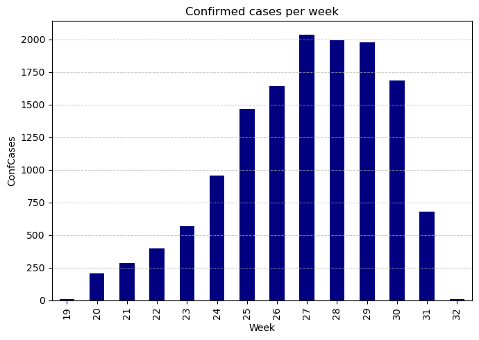
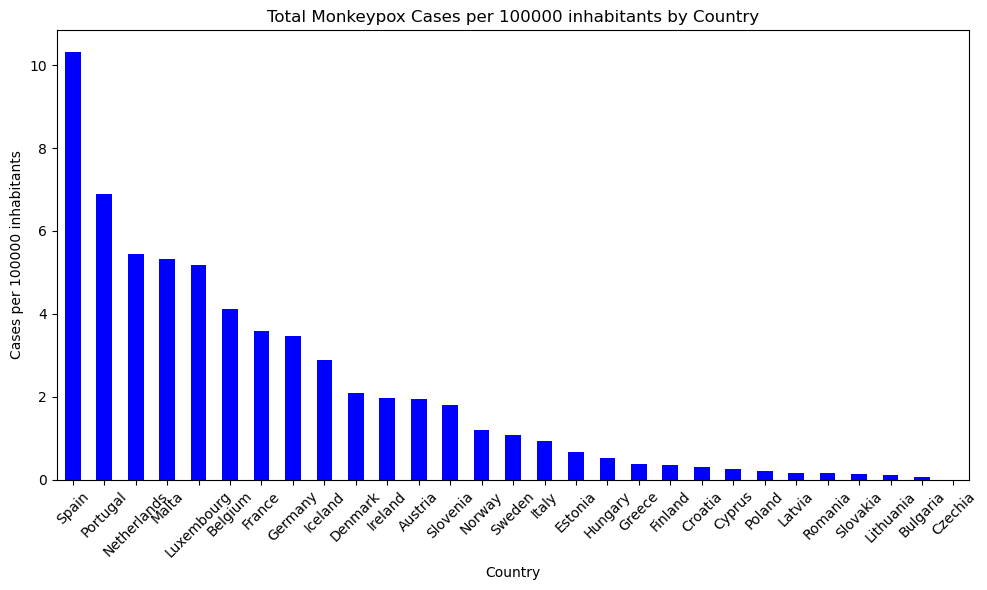
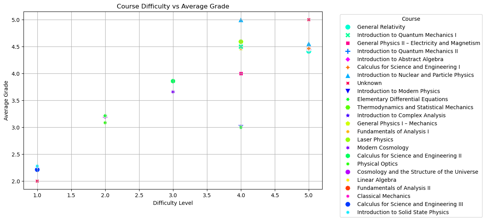

# Exam MT4007 Jan 8, 2024

## Theoretical Part

### 1. Functional Programming (5p)

In functional programming, concepts like immutability, pure functions, and higher-order functions play crucial roles. 

Describe a scenario in a functional language of your choice where the use of a higher-order function enhances the code's readability and maintainability, especially when dealing with immutable data structures. 

Explain how this scenario benefits from the principles of immutability and pure functions.

#### Answer:
In the ralm of functional programming, higher order functions such as Haskells map function significantlly enhance code readability and maintainability. 

Consider a scenario where we have a list of numbers that we need to square. Instead of writing a loop, we can use map with a pure function square.

Here is how it looks in Haskell:


```python
square :: Int -> Int
square x = x * x

squaredNumbers :: [Int] -> [Int]
squaredNumbers nums = map square nums
```

Using map in Haskell simplifes our code by handling list traversal and focusing on the operation applied to each element. 
This approch not only makes the code more readable but also easyier to maintain, as changing the operation simply means replacing the function given to map, leaving the iteration process untouched.

Additionally, this method alligns with the prinsiples of imutability and pure functions. The origina list stays intact, preventing unintended modifications, while the square function remains pure, ensuring consistent outputs without side effects. 
This cobination of pure functions and higher order functions like map enable building complex operations from simpler, predictable ones, therefor increasing the codes reliabillity and clarity.


### 2. SQL (5p)

Imagine a database containing a table StudentsGrades with columns StudentID, CourseID, Grade Credits. 

Write an SQL query to calculate the average grade for each student. 

Explain the significance of grouping data in SQL and how your query demonstrates this concept. 

Note that the average grade is a weighted sum of Grade and Credits. For simplicity, you can imagine that the Grade ranges between 1-5 and Credits range between 5-15.

#### Answer:

SQL query that calculate the average grade for each student:


```python
SELECT StudentID,
       SUM(Grade * Credits) / SUM(Credits) AS WeightedAverageGrade
FROM StudentsGrades
GROUP BY StudentID;
```

Explanation:

The SQL query calculate each students weighted average grade by summing the produkt of grades and credits, then divide by the total credits per student. This is achived using SUM in relationship with GROUP BY, which groups the data by StudentID.

Grouping is significant in sql as it allows for targeted calculations within each group. 
In this case, it enables the calculation of an individualized average for each student, reflecting the diverse weights of different courses. 
My method showcases sqls capability to provide detailed analysis on specific part of data, esential for relevant data interpretation.

### 3. RegEx (5p)

Imagine you have access to a log file generated by a backend REST server. Each log entry records an HTTP request and is formatted as follows:


Timestamp [YYYY-MM-DD HH:MM:SS] - RequestType [GET/POST/PUT/PATCH/DELETE] -
ResourcePath - Status [HTTP status code] - ResponseTime [ms]

For example:

2024-01-05 15:20:30 - GET - /users/1234 - Status 200 - ResponseTime 120ms

Your task is to create a regex pattern that extracts the timestamp, request type, resource path, HTTP status code, and response time from each log entry. 

Explain your regex pattern in detail, focusing on how it accurately parses each part of the log entry. 

Additionally, discuss how the regex pattern can accommodate potential variations in the log format, such as different request types or varying lengths of response times.

#### Answer:

lets create a regex pattern that efficiently extracts key components of each log entry. The pattern is as follows:


```python
(\d{4}-\d{2}-\d{2} \d{2}:\d{2}:\d{2}) - ([A-Z]+) - (\/[\w\/]+) - Status (\d{3}) - ResponseTime (\d+)ms
```

This patern is a good tool for disecting each log entry into its fundamental elements: the timestamp, request type, resource path, http status code, and response time.

The first part of the pattern, `(\d{4}-\d{2}-\d{2} \d{2}:\d{2}:\d{2})`, zeros in on the timestamp, capturein the date and time down to the second in a YYYY-MM-DD HH:MM:SS format. 

Following this, `([A-Z]+)` adeptly picks out the request type, ex. get,post, or any other http method, by matching a sequence of uppercase letters. 
The resource path is neatly captured by `(\/[\w\/]+)`, which is desined to grabe a leading slash folowed by any combination of word characters and slashes.

The pattern then identifies the http status code with `(\d{3})`, targeting exactly three digits, and concludes with `(\d+)ms`, which extract the resbonse time in miliseconds.

The good thing with this regex pattern is its adaptabillity. Its good enough to handle different http method and flexible in capturing diffrent lengths of response times, thanks to the strategi use of quantifiers and character sets. 
This makes the pattern not just accurate for the specified format but also versitile enough to adapt to common variations in log formats.

In summary, this regex pattern demonstrates the effectivenes and accuracy of regular expressions for parsing and extracting important information from structured log entris, highlighting their essential contribution to data processing and analysis.

## Practical Part

### 4. Monkeypox (10p)

The file monkeypox.csv contains information about the number of monkeypox cases in EU/EEA per day and country. Your task is to:

#### 4.1. List the top 5 countries with highest number of total confirmed cases (ConfCases). Generate the following table. (2p)

Lets begin with take a look at the csv file so we understand the structure, we use pandas to load csv file into a dataframe


```python
import pandas as pd

# Load and display data
df = pd.read_csv('monkeypox.csv')   
df.head()
```


<div>
<style scoped>
    .dataframe tbody tr th:only-of-type {
        vertical-align: middle;
    }

    .dataframe tbody tr th {
        vertical-align: top;
    }

    .dataframe thead th {
        text-align: right;
    }
</style>
<table border="1" class="dataframe">
  <thead>
    <tr style="text-align: right;">
      <th></th>
      <th>DateRep</th>
      <th>CountryExp</th>
      <th>CountryCode</th>
      <th>ConfCases</th>
    </tr>
  </thead>
  <tbody>
    <tr>
      <th>0</th>
      <td>2022-05-09</td>
      <td>Austria</td>
      <td>AT</td>
      <td>0</td>
    </tr>
    <tr>
      <th>1</th>
      <td>2022-05-09</td>
      <td>Belgium</td>
      <td>BE</td>
      <td>0</td>
    </tr>
    <tr>
      <th>2</th>
      <td>2022-05-09</td>
      <td>Bulgaria</td>
      <td>BG</td>
      <td>0</td>
    </tr>
    <tr>
      <th>3</th>
      <td>2022-05-09</td>
      <td>Croatia</td>
      <td>HR</td>
      <td>0</td>
    </tr>
    <tr>
      <th>4</th>
      <td>2022-05-09</td>
      <td>Cyprus</td>
      <td>CY</td>
      <td>0</td>
    </tr>
  </tbody>
</table>
</div>


We can see that we got
1. DateRep: The date of the report.
2. CountryExp: The name of the country.
3. CountryCode: The code for the country.
4. ConfCases: The number of confirmed cases on that date.

To recreate the table is pretty simple, first group the data by country and add up the confirmed cases to find the total for each country. 
After that just sort the countries by their total confirmed cases in descending order and select the top 5.


```python
# total data by country
total_cases_by_country = df.groupby('CountryExp')['ConfCases'].sum()

# Sort countries by total confirmed cases in descending order and get the top 5
top_countries = total_cases_by_country.sort_values(ascending=False).head(5)
top_countries
```


    CountryExp
    Spain          4942
    Germany        2887
    France         2423
    Netherlands     959
    Portugal        710
    Name: ConfCases, dtype: int64


looks like we got what we wanted, move on to 4.2.

#### 4.2. Visualise the total number of cases per week. Recreate the following figure. (2p)

What we need to recreate the graph is simple,

First convert the DateRep column into datetime, then get the week number from this column. 
This lets us organize the data by week and calculate the total confirmed cases for each week.

After that group the data by the week and add up the confirmed cases then use matplotlib to make this data into a visualize graph


```python
import matplotlib.pyplot as plt
import matplotlib.dates as mdates

df = pd.read_csv('monkeypox.csv') 

# convert DateRep to datetime
df['DateRep'] = pd.to_datetime(df['DateRep'])

# extract week number
df['Week_Number'] = df['DateRep'].dt.isocalendar().week

# group confirmed cases per week
weekly_cases = df.groupby('Week_Number')['ConfCases'].sum()

# plotting
plt.figure(figsize=(7, 5))
weekly_cases.plot(kind='bar', color='navy')
plt.title('Confirmed cases per week')
plt.xlabel('Week')
plt.ylabel('ConfCases')
plt.grid(axis='y', linestyle='--', linewidth=0.7, alpha=0.7)
plt.tight_layout()
plt.show()

```


    

    


looks somewhat similar, move on to the next one

#### 4.3. Webscrape the following link for population data. The year 2022 is enough. Visualise the total number of cases per 100 000 inhabitant and per country. That is, generate the following plot. (6p) 

https://www.populationu.com/gen/population-by-country

Step 1 is of course webscraping the population data, we can use our knowledge from lecture 10 and hw6.

Basically What we do is look at how many people live in each country in 2022. We can get this information by scrape the url that is provided using tools like requests and BeautifulSoup,after we scrape this data then put it in a dataframe. 
This helps us figure out how common monkeypox is per 100,000 people in the next step.


```python
import requests
from bs4 import BeautifulSoup

# function to scrape population data
def scrape_population_data(url):
    response = requests.get(url)
    if response.status_code != 200:
        raise Exception("Failed to retrieve the webpage")
    # parse the html content
    soup = BeautifulSoup(response.content, 'html.parser')
    #store the data
    population_data = []
    for row in soup.find_all('tr')[1:]:
        cols = row.find_all('td')
        if len(cols) > 2:  
            # extract country name and population for 2022
            country = cols[0].text.strip()
            population = cols[2].text.strip().replace(',', '').replace('.', '')  # Removing commas and dots
            if population.isdigit():
                population_data.append((country, int(population)))
    return pd.DataFrame(population_data, columns=['CountryExp', 'Population2022'])

# url for scraping
url = "https://www.populationu.com/gen/population-by-country"
population_df = scrape_population_data(url)
```

step 2 is merge our scraped population dataset and the monkeypox cases dataset, once we combined then we need to calculating incidence rate, this is the number of cases per 100000 people.

By doing this we can more fairly compare countries, no matter thier population size.

Lastly we will make a visualization of this data in forme of a bar chart, this will clearly show us which countries are most affected by monkeypox.


```python
# Merge population data with the monkeypox dataset
merged_df = df.merge(population_df, on='CountryExp', how='left')

# Calculate cases per 100000 inhabitants,ConfCasesis the column with the number of confirmed cases, then group cases per 100000 by country
merged_df['Cases_per_100k'] = (merged_df['ConfCases'] / merged_df['Population2022']) * 100000
cases_per_100k_by_country = merged_df.groupby('CountryExp')['Cases_per_100k'].sum().sort_values(ascending=False)

# Plotting
plt.figure(figsize=(10, 6))
cases_per_100k_by_country.plot(kind='bar', color='blue')
plt.title('Total Monkeypox Cases per 100000 inhabitants by Country')
#plt.grid(True)
plt.xlabel('Country')
plt.ylabel('Cases per 100000 inhabitants')
plt.xticks(rotation=45)
plt.tight_layout()
plt.show()
```


    

    


```python

```

### 5. Data Storage (10p)

In the file studentlog.txt you can find logs of students and the results of courses they are enrolled in. Your task is to parse this log file, create an SQL database and analyse aspects of the dataset.

#### 5.1. Read in the file studentlog.txt using any method you want and deal with missing entries. Explain your procedure. (4p) 

##### step1. 

Reading the data and understanding data format:

First of all lets open the file and understand the structure, first line is obviously a header line indicating the names of the columns:

"id" "name"	"credits" "difficulty" "grades" "student"

following lines contain the data for each column, separated by tabs, for the example:

42	Introduction to Nuclear and Particle Physics	3	5.0	4.0	Brandon Nelson

2	Introduction to Quantum Mechanics II	3	5.0	4.0	Christopher Baker

##### step2. 

Loading data into dataframe and identify missing entries:

What we do now is load the data into a dataframe structure then identify missing entries and deal with it, we learn this from L5 and HW4.
Data can be missing in different ways, blank spaces or placeholders like "NA" or "null", let's load the data first then decide what to do with them.

The function isnull() is used to check for missing values, it returns a dataframe if each cell is either true (the cell was missing) or false (the data exist).

sum() function sums up the number of true values in each column. This gives us a count of missing entries per column.


```python
import pandas as pd
df = pd.read_csv('studentlog.txt', delimiter='\t')

# Check missing entries in the dataframe then provide a count of missing values for each column
missing_data = df.isnull().sum()
missing_data
```


    Unnamed: 0    0
    id            0
    name          2
    credits       0
    difficulty    6
    grades        2
    student       0
    dtype: int64


As we can see, there is total 10 missing entries:

name: 2 missing entries

difficulty: 6 missing entries

grades: 2 missing entries

The easy option is to simply remove the rows that contain missing values, however according to Lecture 5 ignoring missing values without justification is bad practice because it can lead to loss of data.
The safest way to handle this situation is to fill in the missing values with a default value like what we did in HW4, we can fill missing values in name with "Unknown" and replaced missing numerical values in difficulty and grades with their respective median values.


```python
# replacing missing values in name with unknown
df['name'].fillna('Unknown', inplace=True)

# replacing missing values for difficulty and grades with their respective medians
df['difficulty'].fillna(df['difficulty'].median(), inplace=True)
df['grades'].fillna(df['grades'].median(), inplace=True)

# check if there are any more missing values
df.isnull().sum()
```


    Unnamed: 0    0
    id            0
    name          0
    credits       0
    difficulty    0
    grades        0
    student       0
    dtype: int64


looks like we no longer have any missing entries, we move on to 5.2

#### 5.2. Create an SQL query that genenrates a Student and Course table (2p)

##### step1. 

We use knowledge that we lerned from L7 and HW5 in this question, what we need do in this part is that :

1. from the data in the studentlog table create student table.
2. from the data in the studentlog table create course table.
3. structure the sql query to extract and organize the relevant information into these two new tables(this is things we do in 5.3). 

Here is how we separate them:

student table: This table should contain student info like student name.

course table: This table should contain course info like course id, name, credits excetra.

we will use the the student name as a unique identifier, for courses, we will use the combination of course name, credits, and difficulty as unique identifiers. 

Here is how we create these tables using SQL:

Student Table: Extract distinct student names.

Course Table: Extract distinct combinations of course name, credits, and difficulty.


##### step2. 

creating the sqlite database

lets imports the sqlite3 library and creates a connection to the sqlite database, create one student_data.db if it does not exist.

Then transfers the dataframe into the sqlite database as table named student log, replace it if the table already exists.


```python
import sqlite3

# connecting to sqlite database
conn = sqlite3.connect('student_data.db')
cursor = conn.cursor()

# creating student_log table in the database
df.to_sql('student_log', conn, if_exists='replace', index=False)

```


    1881


This is the number of rows that were read into the dataframe and then inserted into the student log table in our sqlite database. 
basically it indicates that we successfuly imported data.

##### step3. 

Creating the student and course tables, then populate the tables with the data(5.3)

Here we create 2 table named student and course, then insert student names and course details into them.


```python
#sql query to create and populate the student table
student_table_query = """
CREATE TABLE IF NOT EXISTS Student (
    student_name TEXT PRIMARY KEY
);

-- Inserting distinct student names into the Student table
INSERT INTO Student (student_name)
SELECT DISTINCT student
FROM student_log
WHERE student NOT IN (SELECT student_name FROM Student);
"""
# sql query to create and populate the course table
course_table_query = """
CREATE TABLE IF NOT EXISTS Course (
    course_id INTEGER PRIMARY KEY AUTOINCREMENT,
    course_name TEXT,
    credits INTEGER,
    difficulty REAL
);
INSERT INTO Course (course_name, credits, difficulty)
SELECT DISTINCT name, credits, difficulty
FROM student_log;
"""

# executing the queries
cursor.executescript(student_table_query)
cursor.executescript(course_table_query)
```


    <sqlite3.Cursor at 0x7faa4f558fc0>


luckly we dident get any error, this means that the sql commands for creating student and course tables were executed without problems.

##### step4. 

Verify the created tables


```python
#sql command to fetch the names of all tables in the current database.
cursor.execute("SELECT name FROM sqlite_master WHERE type='table';")
#showing the names of all created tables
cursor.fetchall()
```


    [('Student',), ('Course',), ('sqlite_sequence',), ('student_log',)]


we now have 3 items in our database, ignore sqlite_sequence, it is probely a system thing:

student_log: original table with all data that we cleand.

student: table containing student names.

course: table containing courses with details like name, credits, and difficulty.

#### 5.3. Populate the tables with the data from studentlog.txt (1p)

We already imported studentlog data into student and course tables on 5.2, but we can ensure that these tables are correctly populated with the respective data, lets verify them.

The student_log table contains all the data from studentlog.txt.

The student table has been populated with student names from student log.

The course table has been populated with course details from student log.

##### step1. 

Check contents of student log table 


```python
# check the first few rows of student_log
query = "SELECT * FROM student_log LIMIT 7;"
pd.read_sql_query(query, conn)
```


<div>
<style scoped>
    .dataframe tbody tr th:only-of-type {
        vertical-align: middle;
    }

    .dataframe tbody tr th {
        vertical-align: top;
    }

    .dataframe thead th {
        text-align: right;
    }
</style>
<table border="1" class="dataframe">
  <thead>
    <tr style="text-align: right;">
      <th></th>
      <th>Unnamed: 0</th>
      <th>id</th>
      <th>name</th>
      <th>credits</th>
      <th>difficulty</th>
      <th>grades</th>
      <th>student</th>
    </tr>
  </thead>
  <tbody>
    <tr>
      <th>0</th>
      <td>0</td>
      <td>42</td>
      <td>Introduction to Nuclear and Particle Physics</td>
      <td>3</td>
      <td>5.0</td>
      <td>4.0</td>
      <td>Brandon Nelson</td>
    </tr>
    <tr>
      <th>1</th>
      <td>1</td>
      <td>2</td>
      <td>Introduction to Quantum Mechanics II</td>
      <td>3</td>
      <td>5.0</td>
      <td>4.0</td>
      <td>Christopher Baker</td>
    </tr>
    <tr>
      <th>2</th>
      <td>2</td>
      <td>88</td>
      <td>Laser Physics</td>
      <td>3</td>
      <td>4.0</td>
      <td>5.0</td>
      <td>Randy Nelson</td>
    </tr>
    <tr>
      <th>3</th>
      <td>3</td>
      <td>62</td>
      <td>Introduction to Modern Physics</td>
      <td>3</td>
      <td>1.0</td>
      <td>2.0</td>
      <td>Carl Walker</td>
    </tr>
    <tr>
      <th>4</th>
      <td>4</td>
      <td>70</td>
      <td>Calculus for Science and Engineering I</td>
      <td>4</td>
      <td>5.0</td>
      <td>3.0</td>
      <td>Gerald Scott</td>
    </tr>
    <tr>
      <th>5</th>
      <td>5</td>
      <td>79</td>
      <td>Introduction to Abstract Algebra</td>
      <td>3</td>
      <td>5.0</td>
      <td>5.0</td>
      <td>Brandon Roberts</td>
    </tr>
    <tr>
      <th>6</th>
      <td>6</td>
      <td>30</td>
      <td>General Physics II – Electricity and Magnetism</td>
      <td>4</td>
      <td>5.0</td>
      <td>4.0</td>
      <td>Jason Walker</td>
    </tr>
  </tbody>
</table>
</div>


ignore the unnamed columns, forgot to drop them in previous section.

##### step2.

Check contents of student table 


```python
# check the first few rows of student
query = "SELECT * FROM Student LIMIT 7;"
pd.read_sql_query(query, conn)

```


<div>
<style scoped>
    .dataframe tbody tr th:only-of-type {
        vertical-align: middle;
    }

    .dataframe tbody tr th {
        vertical-align: top;
    }

    .dataframe thead th {
        text-align: right;
    }
</style>
<table border="1" class="dataframe">
  <thead>
    <tr style="text-align: right;">
      <th></th>
      <th>student_name</th>
    </tr>
  </thead>
  <tbody>
    <tr>
      <th>0</th>
      <td>Brandon Nelson</td>
    </tr>
    <tr>
      <th>1</th>
      <td>Christopher Baker</td>
    </tr>
    <tr>
      <th>2</th>
      <td>Randy Nelson</td>
    </tr>
    <tr>
      <th>3</th>
      <td>Carl Walker</td>
    </tr>
    <tr>
      <th>4</th>
      <td>Gerald Scott</td>
    </tr>
    <tr>
      <th>5</th>
      <td>Brandon Roberts</td>
    </tr>
    <tr>
      <th>6</th>
      <td>Jason Walker</td>
    </tr>
  </tbody>
</table>
</div>


##### step3. 

Check content of course table 


```python
# check the first few rows of Course
query = "SELECT * FROM Course LIMIT 7;"
pd.read_sql_query(query, conn)

```


<div>
<style scoped>
    .dataframe tbody tr th:only-of-type {
        vertical-align: middle;
    }

    .dataframe tbody tr th {
        vertical-align: top;
    }

    .dataframe thead th {
        text-align: right;
    }
</style>
<table border="1" class="dataframe">
  <thead>
    <tr style="text-align: right;">
      <th></th>
      <th>course_id</th>
      <th>course_name</th>
      <th>credits</th>
      <th>difficulty</th>
    </tr>
  </thead>
  <tbody>
    <tr>
      <th>0</th>
      <td>1</td>
      <td>Introduction to Nuclear and Particle Physics</td>
      <td>3</td>
      <td>5.0</td>
    </tr>
    <tr>
      <th>1</th>
      <td>2</td>
      <td>Introduction to Quantum Mechanics II</td>
      <td>3</td>
      <td>5.0</td>
    </tr>
    <tr>
      <th>2</th>
      <td>3</td>
      <td>Laser Physics</td>
      <td>3</td>
      <td>4.0</td>
    </tr>
    <tr>
      <th>3</th>
      <td>4</td>
      <td>Introduction to Modern Physics</td>
      <td>3</td>
      <td>1.0</td>
    </tr>
    <tr>
      <th>4</th>
      <td>5</td>
      <td>Calculus for Science and Engineering I</td>
      <td>4</td>
      <td>5.0</td>
    </tr>
    <tr>
      <th>5</th>
      <td>6</td>
      <td>Introduction to Abstract Algebra</td>
      <td>3</td>
      <td>5.0</td>
    </tr>
    <tr>
      <th>6</th>
      <td>7</td>
      <td>General Physics II – Electricity and Magnetism</td>
      <td>4</td>
      <td>5.0</td>
    </tr>
  </tbody>
</table>
</div>


everything looks fine, move on to 5.4

#### 5.4. Create a plot that illustrates the most difficult classes. It is up to you to decide what difficult entails. Explain your analysis (3p)

I mean the simplest way to answer this question is just to use the difficulty column, because this column is the official data rated by the institution.
However institution can be out of touch with student, for the exemple a classes with low difficulty could have many students with low grade.

Therefore we can analyze grades in relation to difficulty, we calculate the average grade for each course then plot these average grades against the course difficulty.

I personally think courses with high difficulty ratings and lower average grades can be considered the most difficult.

##### Step1. extract data:


```python
# sql query to extract course name, average grades, and difficulty
query = """
SELECT name, AVG(grades) as avg_grade, difficulty
FROM student_log
GROUP BY name, difficulty
ORDER BY difficulty DESC, avg_grade ASC;
"""

# execute the query and load the data into a dataframe
course_difficulty_df = pd.read_sql_query(query, conn)
```

##### step2. create the Plot:


```python
import matplotlib.pyplot as plt
import seaborn as sns
import numpy as np

# Creating a random color palette, just a cosmetic thing, plot runs just fine without it
np.random.seed(0) 
palette = sns.color_palette("hsv", len(course_difficulty_df['name'].unique()))
np.random.shuffle(palette)  # Shuffle to randomize

# Creating the plot with the random palette
plt.figure(figsize=(10, 6))
sns.scatterplot(data=course_difficulty_df, x='difficulty', y='avg_grade', hue='name', style='name', palette=palette, s=100)
plt.title('Course Difficulty vs Average Grade')
plt.xlabel('Difficulty Level')
plt.ylabel('Average Grade')
plt.legend(title='Course', bbox_to_anchor=(1.05, 1), loc='upper left')
plt.grid(True)
plt.show()

```


    

    


Now there is a few interesting thing in this graph, 2 unknown course is in 2 extreme side, 1 has the lowest difficulty but student has the least avg grade, and another one has highest difficulty but also has highest avg grade.

Due to we filled the data set with our own estemented data, it would be best we ignore them.

According to this graph Introduction to modern physics and Elementary differential equations should be the hardests classes in my own opinions.


